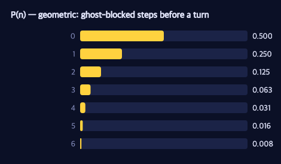

# Probabilistic Programming in Five Minutes

> **Ports** agentmodels.org Ch 1 (the taster snippets) and Ch 2 (the WebPPL/PPL primer).

Stand at a junction in the maze. A ghost is bearing down a corridor, and it has a choice to make: turn left, or turn right. You don't know which. But you can *describe* the not-knowing — and once you can describe it, you can compute with it. That is the whole promise of probabilistic programming, and we can deliver on it before the ghost even reaches you.

A few primitives carry the entire idea. We'll meet them one at a time, motivated by ghosts and corridors, then step back and name what they have in common.

## A coin for the ghost's choice

The ghost's turn is a coin flip. In GenMLX a coin is a one-line generative function:

```clojure
(def coin
  "A one-site probabilistic program: a single fair coin. Its return value IS the
   drawn choice, so `Infer`-ing it (here: forward p/simulate) is a distribution
   over {0,1}."
  (gen [] (trace :c (dist/flip 0.5))))
```

Two things are doing the work here. `dist/flip 0.5` is an *elementary random primitive* — a fair Bernoulli, returning `0` or `1`. And `trace :c` *names* that draw: it records the sampled value at the address `:c` so we can read it back, condition on it, or score it later. A generative function is, at bottom, just ordinary Clojure with named random choices threaded through it.

Running it forward is `p/simulate`. Each call draws a fresh ghost-turn; we map `1`→`H` (right) and `0`→`T` (left) only at the print boundary, because values stay as MLX arrays inside the model:

```clojure
(defn coin-taster
  "Three forward draws from `coin`, each as T/H. Returns the vector of faces."
  []
  (mapv (fn [_]
          (-> (p/simulate coin* []) :retval flip->HT))
        (range 3)))
```

`p/simulate` hands back a **Trace** — the central object of the whole library. A trace bundles three things you can inspect: `:choices` (the choicemap of named draws, here `{:c 1}`), `:retval` (what the program returned), and `:score` (the log-probability of those choices). Everything downstream — conditioning, planning, inference — is built from reading and editing traces.

## Four directions: `categorical`

A coin has two faces; a junction has four exits. When Pac-Man must pick among `:left :right :up :down`, the primitive is `categorical` over a vector of (log-)weights:

```clojure
(def erp-model
  "A handful of ERPs in one program, returned as a structured map. Forward
   p/simulate draws all of them jointly."
  (gen []
    (let [b (trace :bern (dist/bernoulli 0.5))
          c (trace :cat  (dist/categorical (mx/array [0.0 0.0 0.0]))) ; uniform over 3
          g (trace :norm (dist/gaussian 0.0 1.0))
          u (trace :unif (dist/uniform 0.0 1.0))]
      {:bern b :cat c :norm g :unif u})))
```

Equal weights give a uniform choice over the directions (three here, four in a real junction). Note how `bernoulli`, `categorical`, `gaussian`, and `uniform` all live side by side in one `gen` body and return a structured map — a generative function can mix discrete and continuous randomness freely, and forward `p/simulate` draws the whole bundle jointly. That `gaussian` is exactly what you'd use for a noisy estimate of a ghost's position; `uniform`, for jitter in the corridor.

## How far before a ghost blocks you?

Now a genuinely recursive question: Pac-Man walks down a corridor, and at each cell a ghost might cut him off. How many cells does he get? At each step, flip a fair coin — heads, he continues; tails, he's blocked. The count of consecutive continues is a **geometric** random variable, and agentmodels writes it as a recursion: `geometric = function(){ return flip() ? 1 + geometric() : 0 }`.

We can write the same recursion as a generative function. Because we want an *exact* answer (not a sampled estimate), we unroll it to a fixed depth so every flip becomes its own enumeration axis:

```clojure
(defn geometric-recursive
  "Depth-bounded recursive geometric as a gen function. n = number of consecutive
   `continue`s (fair flips landing 1) before the first stop; capped at max-depth."
  [max-depth]
  (gen []
    (loop [i 0, reached (mx/scalar 1.0), n (mx/scalar 0.0)]
      (if (>= i max-depth)
        n
        (let [c        (trace (keyword (str "c" i)) (dist/flip 0.5))
              ;; reached stays 1.0 only while every earlier flip continued
              continue (mx/multiply reached (mx/astype c mx/float32))]
          (recur (inc i) continue (mx/add n continue)))))))
```

The trick is `reached`: it stays `1.0` only while *every* earlier flip continued, so `n` accumulates the length of the leading run of continues — exactly the geometric count, with no host branching that enumeration couldn't follow. The closed form is `P(n = k) = 0.5^{k+1}`, and the mean number of cells is `E[n] = 1`.



Each bar halves the one before it: half the time the ghost blocks immediately (`n=0`), a quarter of the time after one cell, and so on. The long thin tail is why the *average* run is just one cell even though long runs are possible.

For everyday use you'd never unroll by hand — GenMLX ships the primitive, and you can read its pmf straight off the log-probability with `p/assess`, no enumeration needed:

```clojure
(def geometric-builtin
  "The same distribution as a single primitive trace site."
  (gen [] (trace :n (dist/geometric 0.5))))
```

`p/assess` is the trace inspector's mirror image: hand it a model and a fixed choicemap (say `{:n k}`) and it returns the log-probability the model assigns to those choices. `(Math/exp weight)` recovers `0.5^{k+1}` exactly.

## Conditioning: "given Pac-Man survived"

The last primitive is the one that turns description into *inference*. Suppose three ghosts each flip to decide whether to chase, and we learn that at least two of them did. What does that tell us about the first ghost? In GenMLX, a hard condition is a tiny idiom: trace a Bernoulli whose probability is the event's 0/1 mask, then observe it equal to `1`.

```clojure
(def first-flip-given-ge2
  "Three fair flips; condition (via :ge2) on total heads >= 2; RETURN the first
   flip so its marginal is P(first = H | total >= 2)."
  (gen []
    (let [a     (trace :a (dist/flip 0.5))
          b     (trace :b (dist/flip 0.5))
          c     (trace :c (dist/flip 0.5))
          total (reduce mx/add (mapv #(mx/astype % mx/float32) [a b c]))
          mask  (mx/where (mx/greater-equal total (mx/scalar 2.0))
                          (mx/scalar 1.0) (mx/scalar 0.0))]
      (trace :ge2 (dist/bernoulli mask))
      a)))
```

Observing `bernoulli(mask) = 1` contributes `log(mask)`: zero where the event holds, `-∞` where it doesn't — a hard filter that erases the worlds inconsistent with the evidence. Conditioning this model on `:ge2 = 1` and reading the marginal of the first flip gives `P(first = H | total ≥ 2) = 0.75`. Knowing at least two ghosts chased makes it three-to-one that any particular one did. Reframed for the maze: *given Pac-Man reached the pellet, which paths could he have taken?* — the surviving trajectories, reweighted by how likely each was to survive.

## What just happened

Five primitives — `flip`, `categorical`/`gaussian`/`uniform`, a recursive sampler, and `condition` — and one object, the **Trace**, with its `:choices`, `:retval`, and `:score`. Every model in this book is some arrangement of these. What changes from chapter to chapter is not the primitives but the *question* we ask of the trace: forward-simulate it, score it, or condition on evidence and infer backward.

Next we make the maze itself the model: a generative function whose random choices are an agent's *actions*, and whose conditioning is the assumption that the agent is rational.
