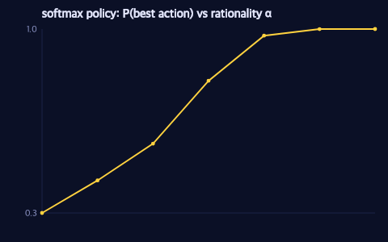

# Agents as Probabilistic Programs: One-Shot Choice at a Junction

> **Ports** agentmodels.org Ch 3 (agents as programs).

Pac-Man rolls to a stop at a 4-way junction. Four corridors leave the cell: a power pellet glows down the left arm, fruit waits to the right, ordinary pellets sit top and bottom. He has one decision to make — which way? Before we write a planner that *searches*, this chapter makes a smaller, sharper claim: the act of choosing is itself a tiny probabilistic program. An agent is a generative function whose single random choice is its action, and the distribution over that choice *is* the agent's rationality. Change one number and the same program slides from a perfect optimizer to a distractible human.

## A junction, scored

Suppose someone has already handed us the value of standing at each neighbouring cell — the expected utility `EU` of each of the four moves. (The next chapter earns those numbers with value iteration; here we take them as given, the way agentmodels' first agent does.) The floor below is shaded by that value function `V(s)`: brighter arms lead to richer caches.


Reading the figure, the two horizontal arms glow most — the fruit (+100) and the power pellet (+50) dominate the two pellet arms (+10 each). A rational Pac-Man should lean right. The question is *how* strongly.

## The policy is one traced choice

In GenMLX an agent's policy is a generative function with exactly one random site: `:action`. The distribution at that site is a *Boltzmann* (soft-max) policy — it turns a vector of expected utilities into a distribution over actions. The whole construction lives in one helper:

```clojure
(defn softmax-action
  "Boltzmann action policy: returns a Categorical distribution over actions
   with logits `alpha * eu`, i.e. action ~ Categorical(softmax(alpha * eu)).

   `eu` is a vector/array of expected utilities, one per action. `alpha` is the
   (inverse-temperature) rationality parameter. With alpha = ##Inf the policy is
   the deterministic argmax, delegated to exact/categorical-argmax so ties break
   uniformly. This is the primary GenMLX realization of factor(alpha * EU)."
  [alpha eu]
  (if (= alpha ##Inf)
    (exact/categorical-argmax eu)
    (dist/categorical (mx/multiply (mx/scalar alpha) eu))))
```

`dist/categorical` treats its argument as *logits* and normalizes through a log-softmax, so feeding it `alpha * eu` yields exactly `Categorical(softmax(alpha · EU))`. That is the GenMLX translation of the move agentmodels makes when it writes `factor(alpha * EU(action))` inside an enumerated action choice: scoring an action by `alpha · EU` and renormalizing is *identical* to drawing it from a softmax over `alpha · EU`. Same maths, expressed as a distribution instead of a side condition.

With the helper in hand the policy itself is a three-line generative function — the core contract of the whole book:

```clojure
;; usage — the agent IS a generative function
(def policy
  (gen [eu]
    (trace :action (softmax-action alpha eu))))

(p/simulate policy [eu])   ;; => a Trace whose :action site holds the chosen move
```

`p/simulate` runs the body, samples the action, and records it as a trace. Every GFI operation now applies for free: `assess` scores an observed move under the policy, `generate` conditions on a chosen direction, `propose` draws one with its weight. The agent is not a special object with a `.act` method — it is a program, and the eleven-protocol machinery from the tutorial treats it like any other.

## Alpha is the rationality knob

The single parameter `alpha` (an inverse temperature) controls *how* rational the agent is, and it interpolates a whole family of agents:

- **`alpha = 0`** — every logit collapses to `0`, the softmax is uniform, and Pac-Man picks a corridor by coin-flip. A drunk ghost-dodger; utility ignored.
- **moderate `alpha`** — a *noisy* but sensible chooser. He usually heads for the fruit, sometimes wanders toward the power pellet, rarely toward a lone pellet. This is the `softMaxAgent`: a plausible model of a human player who mostly does the smart thing.
- **`alpha = ##Inf`** — the limit concentrates all mass on `argmax(EU)`. `softmax-action` makes this exact rather than merely near-exact by short-circuiting to `exact/categorical-argmax`, which also breaks ties uniformly so two equally-good arms split 50/50 instead of relying on float noise. This is the optimal one-step `maxAgent`.

The probability the agent takes the single best action climbs from chance toward certainty as `alpha` grows:



At `alpha = 0` the curve sits at `0.25`: one of four corridors, chosen blind. As `alpha` rises the best arm's share sweeps up toward `1.0`. The shape of that climb is the agent's *temperament*, and it is one scalar in the program — no separate "rational" and "irrational" code paths, just a knob.

## Why this is planning-as-inference

The deepest point is hiding in `dist/categorical`. Because the policy is an honest distribution, choosing an action and *inferring* an action are the same operation viewed from two sides. The forward read is a noisy controller: sample `:action`, watch Pac-Man move. The inverse read is planning-as-inference: imagine we *observe* an outcome — "Pac-Man reached the fruit" — and condition the program on it. Conditioning reshapes the prior over `:action` into a posterior; the moves consistent with eating the fruit gain weight, the rest lose it, and the posterior over `:action` *is* the plan.

The mechanism that makes soft observations like this composable is `factor-dist`, a pseudo-distribution whose log-probability is a free scalar:

```clojure
(defdist factor-dist
  "Soft-conditioning pseudo-distribution. Deterministically draws 0 and
   contributes log-weight w to the trace :score for *any* drawn value, so

     (trace :soft (factor-dist (mx/scalar 2.3)))   ; score += 2.3

   realizes agentmodels' factor(2.3). Mirrors dist/delta but injects an
   arbitrary scalar log-factor rather than a 0/-inf point-mass indicator."
  [w]
  (sample [_key] (mx/scalar 0.0))
  (log-prob [_value] w)
  (support [] [(mx/scalar 0.0)]))
```

Every handler transition accumulates `score += dist-log-prob(value)`, so a distribution whose log-prob is a constant `w` injects exactly `w` into the trace score regardless of what is drawn — which is precisely WebPPL's `factor(w)`, a soft observation that reweights a trace without binding a variable. `softmax-action` is just `factor-dist` specialized to `alpha · EU` and folded into a categorical: the rationality of the policy and the conditioning of inference are *the same primitive*, which is why one program serves both directions.

So the agent at the junction is already a complete probabilistic story. What it still lacks is where the expected utilities come from — right now we *assumed* them. Next we compute `EU` properly by looking more than one step ahead: the Markov decision process and value iteration.
