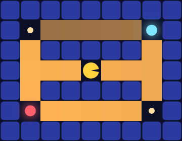
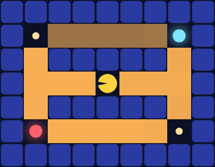

# Gridworld in Depth: Stochastic Transitions and Q-Values

> **Ports** agentmodels.org Ch 3b (stochastic gridworld).

So far Pac-Man has lived in a hallway. Now drop him into a real maze: a 9×7 ring
with four caches at the corners and Pac-Man stranded in the middle. Every cache is
exactly five steps away, so distance tells him nothing — the only thing that breaks
the tie is *value*. Which corner is worth the most? And what happens when the maze
floor turns slippery, and the action he intends is not always the action he gets?

This chapter answers both questions with one machine: compile the maze into
tensors, run value iteration to get a number `V(s)` for every cell, and read off
the optimal route. The glyphs and rewards are fixed on the shared [legend](./legend.md);
here we care about the numbers underneath them.

## The maze, as a tensor

A planner cannot reason about ASCII art. `build-mdp` turns a grid literal into the
three tensors a Markov Decision Process is made of: a transition tensor `T` indexed
by `[state, action, next-state]`, a reward tensor `R` indexed by `[state, action]`,
and a terminal mask. Here is the whole compiler:

```clojure
(defn build-mdp
  [{:keys [grid utilities start gamma noise] :or {utilities {} gamma 1.0 noise 0.0}}]
  (let [{:keys [W H S walls terminals]} (parse-grid grid)
        A          (count action-deltas)
        time-cost  (get utilities :timeCost 0.0)
        ns-fn      (fn [s a] (next-state W H walls s a))
        ;; geometry (host-side, pure CLJS) -> [S,A] table of next-state indices
        ns-rows    (vec (for [s (range S)] (vec (for [a (range A)] (ns-fn s a)))))
        ;; transition tensor: deterministic when noise = 0, orthogonal slip otherwise
        T          (transition-tensor S A ns-rows noise)              ; [S,A,S']
        util       (fn [s] (+ (get utilities (get terminals s) 0.0) time-cost))
        R          (mx/array (clj->js (vec (for [s (range S)] (vec (repeat A (util s))))))
                             mx/float32)                              ; [S,A]
        term       (mx/array (clj->js (vec (for [s (range S)]
                                             (if (contains? terminals s) 1.0 0.0))))
                             mx/float32)                              ; [S]
        [sx sy]    (or start [0 0])
        start-idx  (+ sx (* W sy))]
    (mx/eval! T R term)
    {:W W :H H :S S :A A
     :T T :R R :term term
     :terminals terminals :walls walls :start-idx start-idx
     :ns-fn ns-fn :action-kw action-kw :gamma gamma :noise noise}))
```

Note the purity split that the docstring insists on. The discrete *geometry* —
which cell is a wall, where each of the four actions lands — is tiny and obvious, so
it runs in plain host-side ClojureScript (`ns-rows`). The heavy numeric tensor `T`
is built once, `mx/eval!`-ed, and from there everything is MLX. Reward is just
`utility(s) + timeCost`, broadcast across actions: in our maze every step costs −1,
so a rational Pac-Man pays for distance and the corner he picks had better be worth
the walk.

## A slippery floor

When `noise = 0`, each `T` row is a one-hot vector: action `:right` sends Pac-Man
right, full stop. Turn the noise up and the floor becomes slippery. Crucially, this
is *not* a uniform random action — agentmodels calls it `transitionNoiseProbability`,
and it only ever slips the intended action to one of its two **perpendicular**
directions:

```clojure
;; Orthogonal slip: a horizontal action (left/right) slips to a vertical one
;; (up/down), and vice-versa — agentmodels' transitionNoiseProbability. NOT a
;; uniform random action; the reverse direction is never part of the slip.
(def ^:private perpendicular {0 [2 3] 1 [2 3] 2 [0 1] 3 [0 1]})

(defn transition-tensor
  [S A ns-rows noise]
  (mx/array
    (clj->js
      (vec (for [s (range S)]
             (vec (for [a (range A)]
                    (let [[p q] (perpendicular a)
                          mass  (merge-with +
                                  {(get-in ns-rows [s a]) (- 1.0 noise)}
                                  {(get-in ns-rows [s p]) (* 0.5 noise)}
                                  {(get-in ns-rows [s q]) (* 0.5 noise)})]
                      (mapv #(get mass % 0.0) (range S))))))))
    mx/float32))
```

The intended next-state keeps mass `1 − noise`; the two perpendiculars split the
remaining `noise` evenly. If a slip would push Pac-Man into a wall, `ns-rows`
already encodes "stay put", so that mass falls back onto his current cell — no
probability leaks, every row sums to 1 by construction. The behavioural upshot:
under a slippery floor Pac-Man can no longer trust a corridor that runs alongside a
hazard, because an orthogonal slip might shove him sideways into it. He will *value
cliff-adjacent cells less and detour* around them — exactly the risk-aversion that
emerges, for free, from the transition model.

## Solving for value: the Bellman backup

Given `T`, `R`, and the terminal mask, the value of a state is the discounted
reward Pac-Man can expect if he acts well from here on. Value iteration computes it
by sweeping the Bellman backup until it settles. Each sweep is one matrix-vector
product on the GPU:

```clojure
(defn bellman-step
  "One synchronous Bellman backup (pure MLX graph). V:[S] -> [Q:[S,A], V':[S]].
   next-V[s,a] = Σ_s' T[s,a,s'] * V[s']  via a flat matrix-vector product."
  [{:keys [S A T R term]} gamma alpha value-of V]
  (let [V-col  (mx/reshape V #js [S 1])
        T-flat (mx/reshape T #js [(* S A) S])
        next-V (mx/reshape (mx/matmul T-flat V-col) #js [S A])           ; [S,A]
        cont   (mx/reshape (mx/subtract (mx/scalar 1.0) term) #js [S 1]) ; [S,1] -> bcast over A
        Q      (mx/add R (mx/multiply (mx/scalar gamma)
                                      (mx/multiply cont next-V)))]
    [Q (value-of alpha Q)]))
```

Read it as the definition of a **Q-value**. `Q[s, a]` is the worth of taking action
`a` in state `s`: the immediate reward `R[s, a]` plus the discounted value of where
you land, `Σ_s' T[s,a,s'] * V[s']`. The `cont` factor zeroes the future at terminal
cells — once Pac-Man eats the fruit, the episode is over and there is no
continuation to add. Running this sweep `n` times from `V = 0` is the whole of
`value-iteration`, which returns both `{:Q [S,A] :V [S]}`. The Q tensor is the
per-cell, per-action heatmap; `V` is the best you can do from each cell, and that is
what gets shaded onto the floor.



The shading *is* `V`. The floor glows brightest in the basin around the fruit
(reward +100, bottom-left) and fades toward the modest pellets (+10) at the other
corners. Value is not painted by hand — it diffuses outward from each cache through
the Bellman sweeps, strongest near the richest one. Pac-Man, sitting at the centre
where all four caches are equidistant, sees the brightest gradient pulling toward
the fruit.

## Following the gradient

Reading `V` off the floor, the optimal policy is "climb toward higher value". The
agent's first action at any cell is just the highest-Q action there, and rolling
that policy out from the start produces a trajectory:

```clojure
;; an optimal MDP Pac-Man over the classic maze (alpha = ##Inf is hard argmax)
(def agent (pac/mdp-agent {:maze pac/classic-maze}))
(agent/simulate-mdp agent (:start-idx (:mdp agent)) 30)
;; => {:states [s0 s1 ...] :actions [a0 a1 ...]}
```



Watch where he goes: not to the nearest corner, but to the *most valuable* reachable
one. With four equidistant caches, distance is a wash and value decides — so the
optimal Pac-Man threads left and down to the +100 fruit, leaving the +10 pellets
untouched. That is the entire lesson of value iteration in one walk: the agent does
not search the maze, it follows a number that already encodes the answer at every
cell.

Turn `:noise` up in `pac/mdp-agent` and run it again, and the same machinery bends
the route: cells beside a hazard lose value because a slip could be costly, and
Pac-Man trades a short risky line for a longer safe one — risk-aversion as a
consequence of the model, never a rule we wrote down.

So far Pac-Man can see the whole maze. Next we take that away: a ghost waits
somewhere he cannot see through the walls. When the state is *hidden*, planning is
no longer about a known cell but about a *belief* over where the ghost might be —
the partially observed maze, and the POMDP that solves it.
