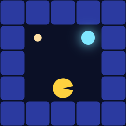
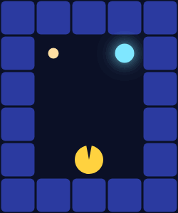

# Hidden State: POMDPs and Belief Over Ghosts

> **Ports** agentmodels.org Ch 3c (POMDPs).

Every maze so far has been fully visible: Pac-Man knew exactly where the reward
was and planned a path to it. But the interesting worlds are the ones he can't
see through. In the *haunted maze* there are two candidate caches at the top — a
pellet and a power pellet — and only **one of them actually pays**. Which one is
hidden state. Pac-Man can't tell by looking; he learns the truth only by walking
onto a single **signpost** floor cell between the two caches. Until then he is
acting under uncertainty.

This is a Partially Observable MDP. The agent no longer knows which world he is
in, so he can't plan against a single MDP. Instead he carries a **belief** — a
distribution over which latent world is the real one — acts on that belief, and
updates it by Bayes' rule whenever an observation arrives. See the
[legend](./legend.md) for the glyph and scoring vocabulary.



The corridor forces the issue. The only path from Pac-Man's start at the bottom
up to the fork runs *through* the signpost, so he must pass the reveal before he
ever has to commit left or right.

## The world, as data

The environment is pure geometry plus an observation model. `restaurant-gridworld`
lays out the two candidate goals, marks the signpost cell, fixes which world is
actually true, and — crucially — defines what Pac-Man can observe from where:

```clojure
(defn restaurant-gridworld
  [{:keys [grid goals signpost true-world start] :or {goals [:A :B] start [0 0]}}]
  (let [W (count (first grid))
        [sx sy] start]
    {:kind       :gridworld
     :grid       grid
     :goals      goals
     :worlds     goals                 ; latent = which goal is rewarding
     :true-world true-world
     :signpost   signpost
     :start-idx  (+ sx (* W sy))
     :prior      (zipmap goals (repeat (/ 1.0 (count goals))))
     ;; deterministic location-gated reveal: standing on the signpost reveals the
     ;; world identity; everywhere else there is no information (obs = nil).
     :observe    (fn [world loc] (when (= loc signpost) world))}))
```

The whole partial-observability story lives in that last line. The `:observe`
function returns the true world only when Pac-Man's location *is* the signpost;
everywhere else it returns `nil`. A `nil` observation carries no information —
it is the **identity** for belief updates. This is what gives the belief its
characteristic *flat-then-snap* shape: nothing happens for step after step, and
then the truth arrives all at once.

## Belief is just a map

There is no special data structure here. A belief is a plain Clojure map from
world to probability, `{:A 0.5 :B 0.5}` at the start. The filter that updates it
is one Bayes step, lifted verbatim from `make-pomdp-agent`:

```clojure
;; one Bayes filtering step: b'(w) ∝ b(w) · P(obs | w, loc).
;; obs = nil (uninformative location) => belief unchanged (flat-then-snap).
update-belief (fn [belief loc obs]
                (if (nil? obs)
                  belief
                  (let [logm (into {} (map (fn [[w b]]
                                             [w (+ (Math/log b)
                                                   (if (= (observe w loc) obs) 0.0 ##-Inf))])
                                           belief))]
                    (if (every? #(= % ##-Inf) (vals logm))
                      belief
                      (inv/normalize-logs logm)))))
```

Read it as Bayes' rule in three moves. If the observation is `nil`, return the
belief untouched — the uninformative case. Otherwise score each world in
log-space: a world that *would* have produced this observation keeps its log-prior
(`+ 0.0`); a world that contradicts the observation is annihilated (`+ ##-Inf`).
Renormalising with `inv/normalize-logs` turns those scores back into a
distribution. (The final guard is defensive: an observation that is impossible
under *every* world leaves the belief unchanged rather than dividing by zero.)

The companion test pins exactly this behaviour. Off the signpost the belief does
not move — `(ub prior 10 nil)` still puts **P(:A) = 0.5**. Step onto the signpost
and observe `:A`, and the belief collapses to a point mass: **P(:A) = 1.0** and
**P(:B) = 0.0** (to 1e-9). Observe `:B` instead and it snaps the other way,
**P(:B) = 1.0**. Every filtered belief sums to **1.0** — it stays a proper
distribution throughout.


Better, watch it move. As Pac-Man walks up toward the signpost the two bars hold
even — he genuinely does not know — and then snap the instant he reads it:


Before the signpost the two bars are even — Pac-Man genuinely doesn't know. After
the reveal, all the mass is on the world the signpost named. That single snap is
the entire epistemic content of the episode.

## Acting on a belief: QMDP

Knowing *what* to believe is half the problem; the agent still has to choose an
action while uncertain. GenMLX builds one fully-solved MDP planner **per world**,
each carrying its own action-value table `Q_w[s,a]`. The belief-space value mixes
those tables under the current belief — this is the **QMDP** approximation:

```clojure
belief-Q  (fn [belief s]
            (let [bvec (mx/array (clj->js (mapv #(double (get belief % 0.0)) worlds-vec)) mx/float32)]
              (mx/sum (mx/multiply (mx/reshape bvec [W 1]) (mx/idx Qstack s 1)) [0])))
```

The per-world `Q` tables are stacked once into a `[W,S,A]` tensor; at state `s`
the belief vector `[W]` is contracted against the `[W,A]` slice in a single fused
MLX reduction. The result is `Q_QMDP(b,s) = Σ_w b(w)·Q_w[s]` — each world's
opinion about the best action, weighted by how strongly Pac-Man believes he is in
that world. The agent then picks an action by softmax over this mixed row, scored
through the GFI exactly like any other policy.

Two properties make this honest. First, the mixture is a genuine convex
combination: the test confirms `belief-Q` at `{:A 0.5 :B 0.5}` equals
`0.5·Q_A + 0.5·Q_B` elementwise (to 1e-4). Second, it **collapses to the
underlying MDP** at certainty — a point-mass belief `{:A 1.0 :B 0.0}` gives a
belief-Q identical to `Q_A` (to 1e-6), and the POMDP agent's chosen action under
that certain belief is *exactly* the bare MDP agent's action. Uncertainty is the
only thing QMDP adds; remove it and you are back to an ordinary planner.

## The rollout: flat, then a snap, then the right fork

Putting it together, `simulate-pomdp` threads state, belief, action, and
observation through the maze. With the optimal regime (`alpha = ##Inf`, noise 0)
the rollout is deterministic, so we can watch the belief evolve step by step:

```clojure
(doseq [[tw goal-idx] [[:A 0] [:B 2]]]
  (let [[e pa] (build tw ##Inf)            ; alpha=Inf + noise 0 => deterministic rollout
        roll   (pomdp/simulate-pomdp pa e (:start-idx e) 12)
        {:keys [states beliefs]} roll]
    ...))
```

When the true world is `:A`, Pac-Man's belief is flat at the start — **P(:A) = 0.5**
— and *still* flat one step later, because he hasn't reached the signpost yet.
On the step he lands on it, the belief **snaps to 1.0**. From there QMDP routes
him to the correct cache, and he reaches goal index **0** (the `:A` cell). Run it
with the truth set to `:B` and the mirror happens: the belief snaps to `:B` and he
ends at index **2**. The belief is monotone toward the truth — it never moves
away from the world that turns out to be real, it only waits and then commits.



This is the resource-rational picture in miniature: Pac-Man spends no effort
guessing while the signpost is out of reach, gathers the one observation the
geometry offers, and acts decisively once it lands.

Next we let the hidden state be richer than a single bit — each corridor
independently open or closed, revealed only when Pac-Man is *adjacent* — and watch
him replan a detour the moment he learns his preferred route is blocked.
