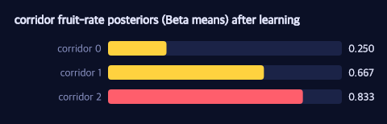
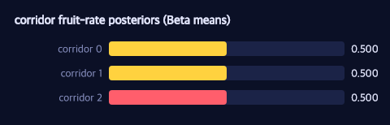

# Learning the Maze: Bandits, Thompson Sampling, and PSRL

> **Ports** agentmodels.org Ch 3d (reinforcement learning), plus the bandit arm of 3c.

Every chapter so far has handed Pac-Man a maze whose rewards he already knows — the pellet is worth +10, the fruit +100, and value iteration grinds out the rest (see [the legend](./legend.md) for the full scoring table). But what if the rewards are *unknown*? Then Pac-Man cannot plan; he must first **learn**. This chapter is about the gap between not-knowing and knowing, and the two algorithms that close it: **Thompson sampling** for the simplest case, and **Posterior Sampling RL (PSRL)** for the full gridworld.

## A bandit is not a maze (a deliberate re-narration)

agentmodels re-stories its multi-armed bandit as a row of restaurants, each with an unknown chance of being good. We do the same trick, but in Pac-Man's vocabulary: imagine `k` corridors, each of which is a **Bernoulli fruit-spawner**. Walk down corridor `i` and with some hidden probability θ_i a fruit appears; otherwise the corridor is empty. The catch is that θ_i is unknown, and the only way to learn it is to *go look* — which costs a turn you could have spent on a corridor you already trust.

This framing is **authored fiction**. A bandit has no geometry: there is no shortest path, no value function over cells, no spatial layout at all. Re-narrating corridors as spawners is faithful to exactly how agentmodels re-stories restaurants and slot machines — it borrows Pac-Man's *imagery* to make an abstract decision problem concrete, while keeping the math honestly non-spatial.

The belief over each corridor is a `Beta(α, β)` distribution — the conjugate prior for a Bernoulli rate. A success bumps α, a failure bumps β, and that single increment *is* the entire posterior update:

```clojure
(defn update-arm
  "Conjugate Beta-Bernoulli posterior update on arm `i`: a success (reward 1)
   bumps alpha, a failure bumps beta; every other arm is untouched (independence)."
  [belief i reward]
  (update-in belief [:arms i]
             (fn [[a b]] (if (== reward 1) [(inc a) b] [a (inc b)]))))
```

No gradient, no sampling, no inference loop — Beta-Bernoulli conjugacy collapses Bayesian learning into a `(inc a)`. The belief is just `{:arms [[a b] ...]}`, one Beta per corridor, and the corridors are independent, so visiting one tells you nothing about the others.

## Thompson sampling: pick by sampling, not by mean

The naive thing is to always pull the corridor with the highest posterior *mean*. That over-exploits: a corridor that looked bad on its first pull gets written off forever. Thompson sampling fixes this elegantly — instead of comparing means, **sample one θ from each posterior and pull the argmax**:

```clojure
:act (fn [{:keys [arms]} key]
       (case strategy
         :thompson
         ;; posterior sampling: draw theta_i ~ Beta(alpha_i,beta_i) per arm and
         ;; pull the argmax.
         (let [av    (mx/array (clj->js (mapv first arms)) mx/float32)    ; [K] alpha
               bv    (mx/array (clj->js (mapv second arms)) mx/float32)   ; [K] beta
               theta (dist/beta-sample-vec av bv key)]                    ; [K] posterior draw
           (int (mx/item (mx/argmax theta))))
         ...))
```

The whole strategy is one line of consequence: `theta (dist/beta-sample-vec av bv key)` draws all `K` corridors' rates in a single MLX op, and `mx/argmax` picks the winner of that draw. The explore-vs-exploit balance is *emergent*, not hand-tuned. When a corridor's Beta is wide (few visits), its sampled θ swings high often enough to get re-tried; once the Beta sharpens, the draws barely move and the agent settles. As the docstring puts it, this is posterior sampling, not the optimal information-valuing policy — but it is strikingly close and almost free.

`make-bandit-agent` hands back exactly the GFI-shaped pieces the rollout needs: an `:act` function, an `:update-belief` (which is `update-arm` above), and an `:arm-values` reporter that returns each corridor's posterior mean α/(α+β). After a run of pulls, those means tell you what Pac-Man learned:



The figure shows the posterior means once the dust settles. Corridor 2 — the real fruit-spawner — concentrates near **0.83**, while a dry corridor sits down near **0.25**. Thompson sampling has discovered the productive corridor without an explicit explore schedule: it simply sampled, acted, and updated until the Betas told it where the fruit lived.

And here is that learning as it happened — the three Beta means updating pull by
pull as fruit and misses arrive:



## PSRL: lifting posterior sampling back into a maze

Thompson sampling works because a bandit's "plan" is trivial — just pull an arm. A real maze is harder: even if you knew the reward map, finding the best route takes planning. **Posterior Sampling RL** is the beautiful generalization. Each episode:

1. **Sample** a hypothesized reward map from the posterior (the maze's Thompson draw),
2. **Plan optimally** for that hypothesis by value iteration,
3. **Act** greedily on the plan, then
4. **Update** the posterior from what was actually found.

Here the unknown is *which free cell is rewarding*. The posterior is a categorical over candidate cells, and because the reward signal is deterministic (a cell either pays out or it does not), the Bayes update is exact — observe a reward and the posterior collapses; observe nothing at a cell and that cell is ruled out:

```clojure
(defn update-posterior
  "Exact Bayes update on observing reward `r` at cell `c`: hypotheses inconsistent
   with the observation are dropped (h=c requires r=1; h≠c requires r=0) and the rest
   renormalized. Observing the reward (r=1 at c) collapses the posterior to c."
  [post c r]
  (let [keep (into {} (filter (fn [[h _]] (= (if (= h c) 1.0 0.0) (double r))) post))
        z    (reduce + (vals keep))]
    (if (pos? z) (update-vals keep #(/ % z)) post)))
```

The Thompson draw over the maze is just as simple — walk the cumulative posterior with a uniform sample:

```clojure
(defn sample-goal
  "Thompson sample: draw a goal cell from the posterior with seed `s`."
  [post s]
  (let [cells (vec (keys post)), u (unit s)]
    (loop [i 0, acc 0.0]
      (let [acc' (+ acc (post (nth cells i)))]
        (if (or (>= i (dec (count cells))) (< u acc')) (nth cells i) (recur (inc i) acc'))))))
```

The episode loop in `psrl` then samples a goal, builds a one-cell reward map for it (`combined-reward`), plans by reusing the *same* `agent/value-iteration` from the planning chapters, rolls out greedily, and folds every visited cell into the posterior. Crucially, the planner is unchanged — PSRL is not a new engine, it is the existing MDP planner wrapped in a sample-plan-act-update shell. That is the chapter's whole thesis in miniature: the agent is a generative function, and *learning* is an orthogonal axis bolted on without touching the planner.

## What the agent actually learns

The companion test pins this down on agentmodels' 4×4 RL grid. Pac-Man starts at the top-left corner; the true reward sits in the bottom-right free cell, **6 steps away** across a 9-step horizon. The optimal agent reaches it in 6 and dwells (using the `stay` action) for the remaining 3, collecting reward on 3 of 9 steps — so the best achievable return is **V\*(start) = 3.0**.

The posterior arithmetic is exact. Before any data, the prior is uniform over the **12 free cells** — each cell gets ≈ 1/12. Observing reward 0 at a cell removes it and renormalizes the survivors; observing reward 1 at the true goal **collapses the posterior to it** with all mass on that single cell (P > 0.999).

Run the full loop and the learning is decisive. Over five seeds, the posterior concentrates on the true goal with **P ≥ 0.99** every time, the final episode achieves **exactly zero regret** — it has converged to the optimal route — and PSRL beats a no-learning baseline (which keeps sampling from the fixed prior and never updates) on cumulative regret in every seed, staying well under the linear `n·V\* = 30` worst case.

Best of all, the regret *plateaus*. Splitting a 12-episode run in half, the test confirms that regret accrued in the second half is **exactly 0.0** — once the posterior collapses, Pac-Man stops paying the exploration tax entirely. That is the signature of posterior sampling: regret is front-loaded into early episodes while the belief is uncertain, then vanishes the moment the maze is learned.

A bandit taught Pac-Man to *learn a rate*; PSRL taught him to *learn a maze*. Next we let the maze hide more than rewards — and watch belief itself become the state.
