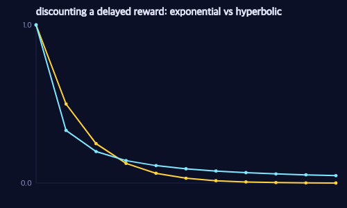

# Time Inconsistency I: Hyperbolic Discounting

> **Ports** agentmodels.org Ch 5a (time inconsistency).

Every agent so far has been rational in a specific sense: it had one stable ranking of futures and it followed it. This chapter breaks that. We give Pac-Man a *human* flaw — he weighs a reward less the longer he must wait for it, but not by a clean exponential. He uses a hyperbolic curve, and that single change makes him disagree with his own past plans. Glyphs and scoring are on the [shared legend](./legend.md).

## The temptation

Picture two corridors to a high-value power pellet. The short one climbs right past a small pellet sitting in an alcove; the long one detours around it. A patient Pac-Man takes the short route — the small pellet is no threat, he just walks past it to the bigger prize. But our discounter has a problem: the closer he gets to that small pellet, the larger it looms, until at the moment he's adjacent it outshines the still-distant power pellet. He veers in, eats it, and the plan is ruined.

The whole mechanism is two tiny functions. First, the discount itself:

```clojure
(defn delta
  "Hyperbolic discount factor at subjective delay `d`: 1/(1 + k·d).
   δ(k,0)=1; strictly decreasing in d for k>0; k=0 ⇒ δ≡1 (no discounting)."
  [k d]
  (/ 1.0 (+ 1.0 (* (double k) (double d)))))
```

A reward `d` steps away is multiplied by `1/(1 + k·d)` rather than the exponential `γ^d`. The test pins the arithmetic exactly: `δ(0,d)=1` for every `d` (no discounting at all), `δ(1,0)=1`, and `δ(2,3)=1/7`. It is also strictly decreasing in `d` for `k>0`. That `1/7` is the crux — compare it to an exponential. Here are the two curves:



The hyperbolic curve (right) starts dropping *faster* than the exponential near `t=0`, then crosses **above** it and lingers in the tail. That crossing is the entire story. Because the early slope is steep, the gap in perceived value between "now" and "one step from now" is huge — so an imminent small reward can beat a larger one that's a few steps off. Yet because the tail is flat, two rewards both far in the future look almost equally valued. As time passes and a far reward becomes a near one, its perceived value shoots up disproportionately, and Pac-Man's ranking flips. That is a **preference reversal**: an exponential discounter can never have one, a hyperbolic discounter cannot avoid one.

## Naive versus sophisticated

The second function is where the two personalities split. When Pac-Man plans, he simulates his own future self choosing actions. The question is: what delay does he assume that future self is operating under?

```clojure
(defn bias->perceived-delay
  "The perceivedDelay function the agent uses for its SIMULATED future self when
   choosing that self's action (agentmodels: perceivedDelay = naive ? delay+1 : 0).
     :naive         → (fn [d] (inc d))   ; believes future self stays patient
     :sophisticated → (fn [_] 0)         ; models future self's present bias
   Only the policy that picks the simulated future action uses this; the
   continuation VALUE always uses the true d+1. At k=0 (δ≡1) both coincide and
   equal the unbiased agent. (Default → sophisticated/0 for any other key.)"
  [bias]
  (case bias
    :naive         inc
    :sophisticated (constantly 0)
    (constantly 0)))
```

The **Naive** agent passes `(inc d)` — he models his future self as *more patient than he is*, with an ever-growing delay clock that flattens the discount. So when he plans, the small pellet four steps away looks negligible: "future me will be patient and walk past it." The **Sophisticated** agent passes `0` — he models his future self as re-planning from delay zero, with exactly the same present-bias he feels right now. He correctly predicts that future-him will succumb, and routes around the temptation in advance.

The asymmetry is razor-thin and it's all in the recursion in `build-biased-eu`. The continuation *value* always uses the true `(inc d)`; only the *policy* that picks the simulated future action uses `(pd-fn d)`:

```clojure
        backup  (fn [s t dv dp]
                  (let [eu    @eu-atom
                        q-pol (mapv (fn [a] (eu s a t dp)) (range A))
                        q-val (if (== dp dv) q-pol (mapv (fn [a] (eu s a t dv)) (range A)))]
                    (case backup-kind
                      :soft
                      (let [w (softmax-vec (mapv #(* alpha %) q-pol))]
                        (reduce + (map * w q-val)))
                      :hard
                      (let [m    (apply max q-pol)
                            idxs (filterv #(> (nth q-pol %) (- m 1e-9)) (range A))]
                        (/ (reduce + (map #(nth q-val %) idxs)) (count idxs))))))
```

`q-pol` ranks actions at the *perceived* delay `dp`; `q-val` averages utilities at the *true* delay `dv`. For the Naive agent `dp = dv` at every node (he never notices the difference), so the two rows coincide — which is exactly why he predicts a future that never arrives. For the Sophisticated agent `dp = 0` while `dv ≥ 1`, and the split is real.

## Plan versus do

This is a generative function like any other — `make-biased-mdp-agent` returns the same `{:policy :act :expected-utility …}` shape as a rational agent, and `simulate-biased-mdp` rolls it out. The twist is that real execution always re-plans from delay zero each step (`(act s)` evaluates EU at `d=0`), so the trajectory the agent *believes* it will follow can diverge from what it *actually does*. `planned-rollout` traces the believed path; `simulate-biased-mdp` traces the real one.

The restaurant grid makes this concrete. With discount `k=3` and a hard (`α=##Inf`) policy, the test sweeps three agents through the 8×6 grid:

```clojure
(def K 3.0)
(let [rational (rest-agent :naive 0.0)              ; k=0 ⇒ unbiased
      naive    (rest-agent :naive K)
      soph     (rest-agent :sophisticated K)]
  (assert-equal "rational (k=0) reaches Veg"             :veg     (bp/restaurant-endpoint rational r-start 16))
  (assert-equal "Naive (k=3) is captured by Donut-North" :donut-n (bp/restaurant-endpoint naive r-start 16))
  (assert-equal "Sophisticated (k=3) reaches Veg"        :veg     (bp/restaurant-endpoint soph  r-start 16)))
```

The rational agent (`k=0`, which collapses the whole machinery back to the unbiased agent — the test confirms `δ≡1` makes it match the standard tensor `Q` to within `1e-4`) walks the short route to the high-value goal. The **Naive** agent (`k=3`) heads for the same goal but is captured by the tempting near reward when he passes adjacent to it: he ends at Donut-North. The **Sophisticated** agent (`k=3`) foresees that capture and takes the long way, reaching the goal. And the plan-versus-do gap is asserted directly: the Naive agent *plans* to reach the goal (`Naive PLANS to reach Veg` → `:veg`) but his actual endpoint differs (`Naive's plan ≠ what it does`), while the Sophisticated agent's plan equals his deed (`plan == do (both Veg)`). The equal-value decoy near the goal is reached by nobody — temptation, not indifference, is what diverts the Naive agent.

The same reversal shows up starkly in the procrastination world: a Naive agent at `k=4` "works on day 0" is false — he `PLANS to work` but `NEVER works in reality`, and his preference over a single state literally flips, preferring to wait at delay 0 (`EU(wait) > EU(work)`) but believing he'll work at delay 1 (`EU(work) > EU(wait)`). Sophistication is the cure: it `completes where Naive fails`, working no later than the Naive agent at every discount the test sweeps.

Naive and Sophisticated differ by one line — `inc` versus `(constantly 0)` — and yet one is doomed to repeat a mistake it can see coming while the other pre-commits its way out. Next we extend this to *bounded* foresight: an agent whose look-ahead is capped, valuing nothing beyond its horizon.
