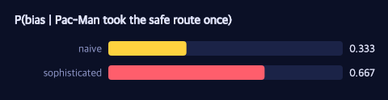

# Joint Inference of Biases and Preferences I

> **Ports** agentmodels.org Ch 5d (joint inference).

In every earlier chapter we knew what kind of mind we were watching. We assumed a
discount rate and inferred a reward, or assumed optimality and inferred noise. But a
real observer faces a harder question: *which kind of agent is this in the first
place?* A Pac-Man who waits at a corridor mouth and never explores the dark branch
might be perfectly rational and simply uninterested — or biased, and merely
short-sighted about a payoff down the corridor. The behaviour is the same; the
explanations are not. So we infer the agent's **type and its parameters jointly**,
and let the data say which story it prefers.

See [the legend](./legend.md) for the maze glyphs and the −1 step cost.

## Two models for the same waiting

The classic test case is *procrastination*. A Pac-Man must hit a switch before a
countdown expires. Each day it can **wait** (cheap, but the deadline creeps closer)
or **work** (pay a cost now, finish the task). Our Pac-Man waits eight days running.
What explains that?

Two models compete over the very same observation. An **Optimal** model fixes the
discount to zero — no present bias allowed — so the only way it can rationalize all
that waiting is to decide the switch reward must be tiny *and* the agent's choices
must be very noisy. A **Possibly-Discounting** model lets the hyperbolic discount
range over `{0, ½, 1, 2, 4}`; it can read the waiting as ordinary time-inconsistency,
keeping the reward respectable and the noise low.

Both are the *same* forward planner — `bp/make-biased-mdp-agent` over a
`bp/procrastination-mdp` — wired into one generative function that traces three
latents:

```clojure
(defn joint-procrastination-model
  "Joint GF tracing :reward, :alpha, :discount (indices into finite prior boxes);
   the sampled tuple selects a precomputed forward agent; one softmax-action site
   :a0 :a1 ... per observed wait-state, scored at the remaining horizon
   (horizon-fn s). All agents + EU-row arrays precomputed before `gen` (the body is
   re-run per enumerated tuple, so it only indexes)."
  [{:keys [states horizon-fn reward-vals alpha-vals discount-vals alpha-probs] :as cfg} agents]
  (let [reward-box   (h/uniform-draw reward-vals)
        alpha-box    (if alpha-probs (h/weighted-draw alpha-vals alpha-probs) (h/uniform-draw alpha-vals))
        discount-box (h/uniform-draw discount-vals)
        rows (into {} (for [[k {:keys [agent]}] agents]
                        [k (mapv (fn [s] (mx/array (eu-row-at agent s (horizon-fn s)) mx/float32))
                                 states)]))]
    (gen []
      (let [ri (trace :reward   (:dist reward-box))
            ai (trace :alpha    (:dist alpha-box))
            di (trace :discount (:dist discount-box))
            er (rows [ri ai di])
            al (:alpha (agents [ri ai di]))]
        (doseq [i (range (count states))]
          (trace (keyword (str "a" i)) (h/softmax-action al (nth er i))))
        [ri ai di]))))
```

Read the body top to bottom and it is just a story about an agent. First sample the
three hidden settings — reward, softmax noise `alpha`, discount — as indices into
finite prior boxes. That tuple *selects* one of the forward agents we precomputed
(no planning happens inside `gen`; the body only indexes the cached expected-utility
rows). Then, for each observed wait-state, the agent emits an action from its softmax
policy `h/softmax-action`. The action site is scored at the **remaining** horizon —
the deadline shrinks as days pass — which is the faithful reading of agentmodels'
`observe(act(state, 0), action)`. The likelihood of "wait" on day `i` is exactly the
policy probability of waiting; there is no bespoke likelihood function anywhere.

## Inverting it by exact enumeration

Because the priors are finite, the inference is exact: enumerate every
`[reward alpha discount]` tuple, ask the model to `p/assess` the full observation
under that tuple, and normalize the resulting log-weights.

```clojure
(defn joint-posterior
  "Exact P(reward,alpha,discount | actions). Enumerate the joint finite prior; for
   each tuple assess the joint GF on the full choicemap; normalize. Returns
   {:joint {[ri ai di] prob} :marginals {:reward {...} :alpha {...} :discount {...}}}."
  [{:keys [states actions reward-vals alpha-vals discount-vals] :as cfg} agents]
  (assert (= (count states) (count actions))
          (str "5d joint: states/actions length mismatch " (count states) " vs " (count actions)))
  (let [model (joint-procrastination-model cfg agents)
        tuples (for [ri (range (count reward-vals))
                     ai (range (count alpha-vals))
                     di (range (count discount-vals))] [ri ai di])
        ;; assess args are [] — joint-procrastination-model returns a gen-fn closing
        ;; over cfg/agents/rows, so its (gen []) body takes no positional args.
        logw (into {} (for [[ri ai di :as tup] tuples]
                        [tup (mx/item (:weight (p/assess (dyn/auto-key model) []
                                                         (multi-full-cm ri ai di actions))))]))
        post (inv/normalize-logs logw)]
    {:joint post
     :marginals {:reward   (marginal post reward-vals 0)
                 :alpha    (marginal post alpha-vals 1)
                 :discount (marginal post discount-vals 2)}}))
```

The engine never changed. `p/assess` is the same GFI operation used everywhere in the
library; here it scores a fully-constrained choicemap (the latent tuple plus the
observed actions) and hands back a log-weight. Joint inference is just enumeration
plus normalization on top of that contract — exactly the orthogonality this book keeps
arguing for. The result is a joint distribution over the agent's hidden type, with
clean marginals for each latent.



The figure above is illustrative — a representative joint posterior over an agent's
hidden settings, not these exact procrastination marginals. What you should take from
it is the *shape*: joint inference returns a full distribution over the type, with
mass pooling on the explanations that fit, rather than a single point estimate.

## What the two models conclude

Run both models on the eight observed waits (`j5d/analyze`) and the contrast is
stark. The **Optimal** model, forbidden from invoking present bias, is cornered into
a low-reward, high-noise explanation: its posterior reward expectation collapses to
**E[reward] ≈ 0.530** and its noise expectation balloons to **E[alpha] ≈ 457.5**.
Translated: "the switch is barely worth anything, and this agent is essentially
flipping coins." The **Possibly-Discounting** model tells a kinder story — it keeps
**E[reward] ≈ 2.849** and reads the waiting off the discount instead, with
**E[discount] ≈ 2.631**.

This shows up directly in prediction. Asked for the posterior-predictive probability
that Pac-Man finally works at the last minute, the Optimal model says
**P(work) ≈ 0.0056** while the discounting model says **P(work) ≈ 0.216** — a factor
of more than thirty between them (both still below 0.3, because eight straight waits
is strong evidence of a procrastinator either way).

## The moment the task completes

The decisive test is what happens when the waiting *ends*. Append a ninth
observation — Pac-Man finally hits the switch at `W_8` — and re-infer. The two models
revise in opposite ways.

```clojure
(defn online-posteriors
  "Posterior expectations + predict-work after each prefix of the observed
   sequence (index 0 = prior). Reuses joint-posterior on truncated observations."
  [{:keys [states actions] :as cfg} agents predict-state predict-horizon]
  (mapv (fn [L]
          (let [c (assoc cfg :states (vec (take L states)) :actions (vec (take L actions)))
                {:keys [joint marginals]} (joint-posterior c agents)]
            {:n L
             :E-reward   (expect (:reward marginals))
             :E-alpha    (expect (:alpha marginals))
             :E-discount (expect (:discount marginals))
             :predict-work (predict-work joint agents predict-state predict-horizon)}))
        (range (inc (count states)))))
```

The Optimal model's "noisy and indifferent" story cannot survive a deliberate
completion. Its reward expectation jumps by **more than 2.0**, and — most tellingly —
its inferred noise *collapses by over 100×*: the moment the agent acts purposefully,
"random flailing" stops being a credible account. The discounting model barely
flinches: its alpha changes by **less than 3×** (it never needed high noise), while
its reward rises moderately by **more than 1.0**. The Optimal model's alpha revision
dwarfs the discounting model's — it had the most to take back.

The online sequence makes the build-up visible too. It returns **nine** entries —
the prior plus one per observation. Index 0 is the untouched prior (its
`E[discount]` sits exactly at the prior mean **1.5**). As the waits accumulate,
`predict-work` *falls* and `E[discount]` *rises* toward **≈ 2.63** — the observer
watching the evidence pile up and concluding, day by day, that it is looking at a
procrastinator.

Next we extend the same joint machinery from a one-dimensional countdown to spatial
exploration — inferring not just *how* biased a Pac-Man is, but *whether the bias
exists at all*.
