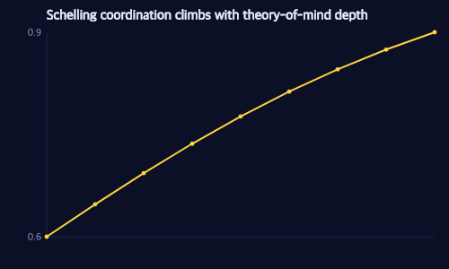
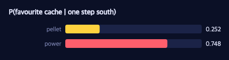

# Multi-Agent Models: Coordination, Adversaries, and Signaling

> **Ports** agentmodels.org Chapter 7 (multi-agent).

So far every Pac-Man has reasoned about a *maze*. Now they reason about *each
other*. An agent who models another agent is still just a generative function —
only now the world it samples from contains a second mind. That recursion is the
whole subject of this chapter, and it shows up in three guises: two Pac-Men
trying to *meet*, a Pac-Man trying to *escape* a ghost, and a Pac-Man trying to
*signal* where a ghost is. (The glyphs and scoring live on the shared
[legend](./legend.md).)

## Coordination: meeting at the focal corridor

Two Pac-Men want to rendezvous at a junction. They cannot communicate; each can
only *imagine* where the other will go and try to match. The maze has a popular
corridor and an unpopular one — a slight bias, `0.55` versus `0.45`. That tiny
asymmetry is a *focal point*: a place that stands out enough to coordinate on.

Here is the core coordination model. It samples both locations and then
*conditions on meeting* using the native bernoulli-observe idiom — a Bernoulli
whose success probability is `1` exactly when the two locations match, observed
to be `1`:

```clojure
(defn coordination-model
  "One agent reasoning about the other: sample my location ~ prior and the other's
   ~ `other-probs`, then CONDITION on meeting."
  [other-probs]
  (gen []
    (let [other (trace :other (dist/categorical (mx/log other-probs)))
          me    (trace :me    (dist/categorical (mx/log location-prior)))
          match (.astype (mx/equal me other) mx/float32)]
      (trace :meet (dist/bernoulli match))           ; observed = 1  ⇒  condition(me == other)
      me)))
```

Nothing here decides *how* we reason about that model. The posterior over `:me`
is produced by a pluggable backend — exact enumeration by default, importance
sampling on demand — and `coordinate` just hands the model and the
"meeting-happened" observation to whatever `infer` it is given:

```clojure
(defn coordinate
  "The coordination posterior over my location (the [2] marginal of :me), given the
   other agent's location distribution. `infer` is the pluggable reasoning backend."
  [other-probs infer]
  (infer (coordination-model other-probs) MEET :me 2))
```

The interesting part is the recursion of theory-of-mind. Alice at depth `d`
coordinates with her *model* of Bob at depth `d-1`; Bob at depth `d` coordinates
with Alice at depth `d`; and Bob at depth `0` is the non-strategic base case who
simply follows the prior. Each agent is memoized over the depth ladder so the
mutual recursion terminates:

```clojure
(defn schelling-agents
  ([] (schelling-agents exact-marginal))
  ([infer]
   (let [alice (atom nil)
         bob   (atom nil)]
     (reset! alice (exact/with-cache (fn [d] (coordinate (@bob (dec d)) infer))))
     (reset! bob   (exact/with-cache (fn [d] (if (zero? d)
                                               location-prior
                                               (coordinate (@alice d) infer)))))
     {:alice @alice :bob @bob})))
```

Why does this converge on the popular corridor? Because conditioning on a *match*
multiplies each agent's belief by the other's belief, and that product is sharper
than either factor — the `0.55` bias compounds at every rung. The test confirms
the climb exactly. Bob at depth `0` is just the prior, `P(popular) = 0.55`. One
level of reasoning lifts Alice to `0.5990` and Bob to `0.6461`; a second level
reaches Alice `0.6905` and Bob `0.7317`. The probability is *strictly increasing*
in depth, and by depth `4` Alice's belief in the popular corridor has climbed to
at least `0.83`. Deeper theory-of-mind doesn't add information — it amplifies the
one asymmetry that was already there until the focal point dominates.



Crucially, *the agents never change*. Swapping the exact backend for importance
sampling over the very same `coordination-model` GF reproduces the answer: exact
Alice(1) `0.5990` versus importance-sampled Alice(1) within a tolerance of `0.05`
across `4000` samples. Inference is an axis orthogonal to the model — the entire
thesis of `genmlx.agents` in one assertion.

## Adversary: Pac-Man versus the ghost (a classical baseline)

When the second agent is a *ghost* instead of a partner, coordination becomes
conflict, and the natural tool is game-tree search. The model represents this as
a recursive value over board positions — the mover picks a move under a softmax
policy of its *own* continuation value, while the value passed up to the scorer
is the expectation under the mover's policy. As `α → ∞` the softmax collapses to
an `argmax`, and soft expectimax becomes hard, adversarial minimax:

```clojure
(reset! val
  (exact/with-cache
    (fn [board mover scorer]
      (if (terminal? board)
        (utility board scorer)
        (let [ms  (legal-moves board)
              qs  (mapv (fn [m] (@val (place board m mover) (other-player mover) mover)) ms)
              pol (policy-weights alpha qs)
              vs  (mapv (fn [m] (@val (place board m mover) (other-player mover) scorer)) ms)]
          (reduce + (map * pol vs)))))))
```

**A deliberate honesty note:** this minimax/expectimax tree search is a
*classical baseline*, not GFI inference. It is the one place this book steps
outside the agent-as-generative-function frame. The recursion above is plain host
arithmetic over a transposition table (`with-cache`); MLX appears only in the
final `softmax-action` policy distribution. The pure-search agent is included
because the chapter needs a strong adversary to plan *against*, not because it is
itself a probabilistic program.

The test exercises it on two tic-tac-toe positions that stand in for the
escape-and-block dynamics of a chase. On a forced-win board the planning agent
completes the line at cell `2`, and so does the one-step agent — an immediate win
needs no lookahead. The discriminator is the forced-*block* board: planning
blocks at cell `5` to salvage a draw (value `0`) instead of conceding a loss
(value `−10`), so the block's value strictly beats every alternative, while the
non-planning agent is *indifferent* — every immediate move is non-terminal and
scores `0`. Lookahead is exactly what separates a Pac-Man who survives from one
who walks into the ghost. At `α = ∞` the softmax-action policy is deterministic:
five rollouts all take cell `2`, and `best-move` is bit-repeatable.

## Signaling: literal versus pragmatic listeners

The third multi-agent pattern is *communication*. A Pac-Man emits a signal about
ghost positions; a partner interprets it. The Rational Speech Acts (RSA) tower
formalizes how interpretation deepens with reasoning. A denotation matrix says
which signals are literally true of which world-states; the literal listener
`L0` takes a signal at face value, a state `~ prior` conditioned on the signal's
meaning holding:

```clojure
(defn literal-listener-model
  "L0 as a GF: a state ~ prior, observe that the utterance's denotation (`truth-row`,
   a [n-states] 0/1 vector gathered at the sampled state) holds."
  [state-prior truth-row]
  (gen []
    (let [s (trace :s (dist/categorical (mx/log state-prior)))]
      (trace :holds (dist/bernoulli (mx/take-idx truth-row s)))   ; observed = 1 ⇒ condition(denotes)
      s)))
```

The pragmatic *speaker* `S1` is a softmax-action agent — `factor(α·EU)` with
utility equal to the literal listener's log-score — and the pragmatic *listener*
`L1` is the Bayesian inversion of that speaker. The chapter's canonical example is
scalar implicature: utterances `[all some none]` over states `[0 1 2 3]` counting
sprouted seeds. Literally, "some" is true of states `{1,2,3}`, so `L0(some)`
spreads uniformly — `1/3` on each, `0` on state `0`. But a speaker who *knew* all
three sprouted would almost surely say "all": `S1(all | s=3) = 0.9`, leaving only
`0.1` for "some". The pragmatic listener reasons backward through that choice. On
hearing "some" she infers the speaker *would have said "all" if all were true*,
so `L1(some)` concentrates on the middle states — `10/21` on state `1`, `10/21`
on state `2` — and assigns a mere `1/21` to "all" (state `3`) and `0` to "none".
The weak word implies *not-all*: this is the scalar implicature, derived rather
than stipulated, with `P(3 | some) ≪ P(1 | some)`.

The figure below shows the kind of sharply asymmetric posterior this recursive
reasoning produces — most of the mass shifted onto the pragmatically-favored
interpretation and almost none on the literal-but-uninformative alternative,
exactly the shape of `L1(some)` above:



The same tower, fed a different denotation, yields referential implicature: an
ambiguous "uboth" signal that is literally true of two referents resolves toward
the one the unambiguous signal *didn't* claim, `P(r1 | uboth) = 0.75` versus
`0.25` for `r0`. And because `L0` runs through the pluggable inference seam, the
implicature survives even when the literal listener is *sampled* rather than
enumerated — a mixed pipeline (importance-sampled `L0`, exact `S1`/`L1`) still
gives `P(0 | some) = 0` exactly and `P(1 | some) ≈ P(2 | some) ≈ 0.476`. The
backend moved; the meaning did not.

---

Coordination, conflict, and communication all reduce to one move: putting a
*model of another agent* inside your own generative function. That completes the
agentmodels arc in the maze. The next chapter is a quick-start tour of the
`genmlx.agents` library itself — every agent family we have met, reachable behind a
single `require`.
