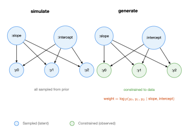

# Conditioning: The Core Trick

In the previous chapter, we ran models forward with `simulate` — sampling every random choice from its prior distribution. That's useful for understanding what a model can generate, but it's not inference. Inference starts when you have **data** and want to ask: given what I observed, what are the likely values of the things I didn't observe?

The answer is one operation: `generate`. It takes the same model, the same arguments, but also a **choice map of observations** — values you want to fix. The model runs as before, but at observed addresses, the handler uses the constrained value instead of sampling. Everything else is sampled from the prior. The result includes a **weight** — the log-probability of the observations given the sampled latent variables.

This is the core trick of probabilistic programming: **the same model code, with no modifications, supports both simulation and conditioned inference.** The model declares *what* it needs; the handler decides *how*.

## Building choice maps

A choice map specifies which addresses to constrain and what values to fix them to:

```clojure
(def obs (cm/choicemap :y0 (mx/scalar 2.5)
                       :y1 (mx/scalar 4.5)
                       :y2 (mx/scalar 6.5)))
```

This says: "at address `:y0`, the value must be 2.5; at `:y1`, it must be 4.5; at `:y2`, it must be 6.5." All other addresses (`:slope`, `:intercept`) are unconstrained — the handler will sample them from the prior.

## Generate: constrained execution

Pass the observations to `generate` along with the model and its arguments:

```clojure
(let [model (dyn/auto-key linear-model)
      obs (cm/choicemap :y0 (mx/scalar 2.5) :y1 (mx/scalar 4.5) :y2 (mx/scalar 6.5))
      {:keys [trace weight]} (p/generate model [xs] obs)]
  (println "slope:" (mx/item (cm/get-choice (:choices trace) [:slope])))
  (println "intercept:" (mx/item (cm/get-choice (:choices trace) [:intercept])))
  (println "y0:" (mx/item (cm/get-choice (:choices trace) [:y0])))
  (println "weight:" (mx/item weight)))
```

The trace looks just like one from `simulate` — it has all the same addresses. But the observed addresses are fixed to the values you provided:

- `:slope` and `:intercept` — **sampled** from the prior (different each time you call `generate`)
- `:y0`, `:y1`, `:y2` — **constrained** to exactly 2.5, 4.5, 6.5 (same every time)

## The weight

`generate` returns a weight alongside the trace. The weight is the log-probability of the observed values under the distributions they were constrained to:

\\[
\log w = \sum_{a \in \text{observed}} \log p_a(\text{observed value})
\\]

In our linear regression, this is \\(\log p(y_0 \mid \text{slope}, \text{intercept}) + \log p(y_1 \mid \cdots) + \log p(y_2 \mid \cdots)\\). When the sampled slope and intercept happen to explain the data well, the weight is high. When they don't, the weight is low.

This weight is what makes inference possible.

## Same model, different interpretation

Here's the key insight. Compare what happens at address `:y0`:

- Under `simulate`: the handler **samples** \\(y_0 \sim \mathcal{N}(\text{slope} \cdot x_0 + \text{intercept}, 1)\\) and records the value.
- Under `generate` with `:y0` constrained: the handler **uses** the constrained value 2.5 and adds \\(\log p(2.5 \mid \text{slope} \cdot x_0 + \text{intercept}, 1)\\) to the weight.

The model body is identical in both cases. It calls `(trace :y0 (dist/gaussian ...))` — declaring what it needs. The handler decides the semantics. This is what we mean by "your model is pure; the framework manages state."



## Importance sampling by hand

With `generate` and weights, we can build importance sampling from scratch. The idea: run `generate` many times, each time sampling different latent values from the prior. The weights tell us which samples explain the data best.

```clojure
(let [model (dyn/auto-key linear-model)
      obs (cm/choicemap :y0 (mx/scalar 2.5) :y1 (mx/scalar 4.5) :y2 (mx/scalar 6.5))
      n 50
      results (mapv (fn [_] (p/generate model [xs] obs)) (range n))
      log-weights (mapv #(mx/item (:weight %)) results)
      ;; Normalize weights to probabilities
      max-w (apply max log-weights)
      unnorm (mapv #(js/Math.exp (- % max-w)) log-weights)
      total (reduce + unnorm)
      weights (mapv #(/ % total) unnorm)
      ;; Weighted mean of slope
      slopes (mapv #(mx/item (cm/get-choice (:choices (:trace %)) [:slope])) results)
      weighted-mean (reduce + (map * slopes weights))]
  (println "estimated slope:" (.toFixed weighted-mean 3)))
```

The normalization trick (subtract `max-w` before exponentiating) prevents numerical underflow. The weighted mean gives an estimate of the posterior mean of the slope — the expected value of the slope given the data.

With data points at \\(x = [1, 2, 3]\\) and \\(y = [2.5, 4.5, 6.5]\\), the true relationship is roughly \\(y = 2x + 0.5\\), so we expect the posterior mean of the slope to be near 2.

## The built-in version

GenMLX provides `importance-sampling` so you don't have to write the loop yourself:

```clojure
(let [model linear-model
      obs (cm/choicemap :y0 (mx/scalar 2.5) :y1 (mx/scalar 4.5) :y2 (mx/scalar 6.5))
      {:keys [traces log-weights log-ml-estimate]}
      (importance/importance-sampling {:samples 100} model [xs] obs)]
  (println "number of traces:" (count traces))
  (println "log marginal likelihood:" (mx/item log-ml-estimate)))
```

It returns:
- `:traces` — a vector of 100 traces, each with different latent values
- `:log-weights` — the log-weight of each trace
- `:log-ml-estimate` — an estimate of the log marginal likelihood of the data

## Log marginal likelihood

The log marginal likelihood \\(\log \hat{Z}\\) estimates how well the model explains the data, averaged over all possible parameter values:

\\[
\log \hat{Z} = \log \frac{1}{N} \sum_{i=1}^{N} \exp(\log w_i)
\\]

This is computed via `logsumexp` for numerical stability. It's useful for model comparison — a model with higher log marginal likelihood explains the data better.

Running importance sampling twice with the same observations gives similar estimates:

```clojure
(let [model linear-model
      obs (cm/choicemap :y0 (mx/scalar 2.5) :y1 (mx/scalar 4.5) :y2 (mx/scalar 6.5))
      r1 (importance/importance-sampling {:samples 200} model [xs] obs)
      r2 (importance/importance-sampling {:samples 200} model [xs] obs)]
  (println "estimate 1:" (.toFixed (mx/item (:log-ml-estimate r1)) 2))
  (println "estimate 2:" (.toFixed (mx/item (:log-ml-estimate r2)) 2)))
```

The estimates won't be identical (they're stochastic) but they should be close. More particles means less variance.

## Prior vs posterior

The whole point of conditioning is that the posterior is different from the prior. Let's verify:

```clojure
(let [model (dyn/auto-key linear-model)
      obs (cm/choicemap :y0 (mx/scalar 2.5) :y1 (mx/scalar 4.5) :y2 (mx/scalar 6.5))
      ;; Prior: simulate 50 times, collect slopes
      prior-slopes (mapv (fn [_]
                           (mx/item (cm/get-choice
                                      (:choices (p/simulate model [xs])) [:slope])))
                         (range 50))
      prior-mean (/ (reduce + prior-slopes) (count prior-slopes))
      ;; Posterior: generate 100 times, weight, compute weighted mean
      results (mapv (fn [_] (p/generate model [xs] obs)) (range 100))
      log-ws (mapv #(mx/item (:weight %)) results)
      slopes (mapv #(mx/item (cm/get-choice (:choices (:trace %)) [:slope])) results)
      max-w (apply max log-ws)
      ws (mapv #(/ (js/Math.exp (- % max-w))
                    (reduce + (mapv (fn [lw] (js/Math.exp (- lw max-w))) log-ws)))
               log-ws)
      post-mean (reduce + (map * slopes ws))]
  (println "prior mean slope:" (.toFixed prior-mean 2))
  (println "posterior mean slope:" (.toFixed post-mean 2)))
```

The prior mean should be near 0 (our prior is \\(\mathcal{N}(0, 10)\\)). The posterior mean should be near 2 — pulled toward the data. That shift from prior to posterior is inference.

## Nested choice maps

When models are composed via `splice` (which we'll cover in [Chapter 6](./ch06-composition.md)), choice maps can be nested. You can build nested choice maps directly:

```clojure
(def nested-obs
  (cm/choicemap :params (cm/choicemap :slope (mx/scalar 2.0)
                                      :intercept (mx/scalar 1.0))))

;; Access nested values
(println (mx/item (cm/get-choice nested-obs [:params :slope])))  ;; => 2.0
```

Or use `cm/from-map` for convenience:

```clojure
(def from-map-obs (cm/from-map {:a {:b 3.0} :c 5.0}))
(println (cm/get-choice from-map-obs [:a :b]))  ;; => 3.0
```

Nested choice maps mirror the hierarchical address structure that `splice` creates — each sub-model's choices live under the splice address.

## What we've learned

- `generate` runs a model with some addresses constrained to observed values.
- The **weight** is the log-probability of the observations given the sampled latent variables.
- The same model code works with both `simulate` and `generate` — the handler determines the interpretation.
- **Importance sampling** runs `generate` many times and uses the weights to estimate posterior expectations.
- The **log marginal likelihood** estimates how well the model explains the data.
- Choice maps can be nested for composed models.

The key idea: **conditioning is not a modification to the model. It's a different interpretation of the same model by a different handler.** The model declares random choices; the handler decides whether to sample or constrain.

In the next chapter, we'll look inside the handler to see exactly how this works.
