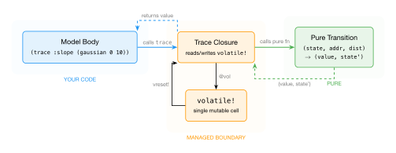

# How It Works: The Handler Loop

The previous two chapters showed you `simulate` and `generate` — two operations on the same model that produce different results. Now we'll look inside to see *how* they work. The mechanism is simple, elegant, and worth understanding because it explains why everything else in GenMLX — composition, vectorization, compilation — works the way it does.

The core idea: **each GFI operation is a pure function that interprets `trace` differently**. The model body doesn't know which interpretation is running. A thin runtime layer manages the single piece of mutable state that threads between calls.

## The handler is a pure function

Every GFI operation is implemented as a *handler transition* — a pure function with this signature:

```
(state, address, distribution) → (value, state')
```

It takes the current state, an address, and a distribution. It returns a value and a new state. No mutation, no global variables, no side effects. The state is an immutable Clojure map.

Here is the actual `simulate-transition` from GenMLX's source:

```clojure
(defn simulate-transition [state addr dist]
  (let [[k1 k2] (rng/split (:key state))
        value    (dc/dist-sample dist k2)
        lp       (dc/dist-log-prob dist value)]
    [value (-> state
               (assoc :key k1)
               (update :choices cm/set-value addr value)
               (update :score #(mx/add % lp)))]))
```

Step by step:
1. Split the PRNG key into two: `k1` for future use, `k2` for this sample.
2. Sample a value from the distribution using `k2`.
3. Compute the log-probability of that value.
4. Return the value and a new state with: the advanced key, the choice recorded, and the score accumulated.

The original state is untouched — `assoc` and `update` return new maps. This is what we mean by *pure*.

We can call it directly and verify:

```clojure
(let [key (rng/fresh-key)
      init-state {:key key :choices cm/EMPTY :score (mx/scalar 0.0)}
      d (dist/gaussian 0 1)
      [value state'] (h/simulate-transition init-state :x d)]
  (println "value:" (mx/item value))
  (println "has :x?" (cm/has-value? (cm/get-submap (:choices state') :x)))
  (println "score:" (mx/item (:score state')))
  ;; The original state is unchanged
  (println "original choices still empty?" (= cm/EMPTY (:choices init-state))))
```

## The generate transition

Now look at `generate-transition`:

```clojure
(defn generate-transition [state addr dist]
  (let [constraint (cm/get-submap (:constraints state) addr)]
    (if (cm/has-value? constraint)
      (let [value (cm/get-value constraint)
            lp    (dc/dist-log-prob dist value)]
        [value (-> state
                   (update :choices cm/set-value addr value)
                   (update :score #(mx/add % lp))
                   (update :weight #(mx/add % lp)))])
      (simulate-transition state addr dist))))
```

The only difference from `simulate-transition`: it checks whether a constraint exists at this address. If yes, it uses the constrained value and adds the log-probability to both `:score` and `:weight`. If no, it delegates to `simulate-transition`.

That's it. The entire difference between `simulate` and `generate` at the handler level is a single `if`.

```clojure
;; Constrained: uses the value you provide
(let [constraints (cm/choicemap :x (mx/scalar 3.0))
      state {:key (rng/fresh-key) :choices cm/EMPTY :score (mx/scalar 0.0)
             :weight (mx/scalar 0.0) :constraints constraints}
      [value state'] (h/generate-transition state :x (dist/gaussian 0 1))]
  (println "value:" (mx/item value))           ;; => 3.0
  (println "weight:" (mx/item (:weight state')))) ;; => log p(3.0 | N(0,1))

;; Unconstrained: falls through to simulate
(let [state {:key (rng/fresh-key) :choices cm/EMPTY :score (mx/scalar 0.0)
             :weight (mx/scalar 0.0) :constraints cm/EMPTY}
      [value state'] (h/generate-transition state :x (dist/gaussian 0 1))]
  (println "value:" (mx/item value))           ;; => random sample
  (println "weight:" (mx/item (:weight state')))) ;; => 0.0
```

## Handler state

The handler state is a plain Clojure map. Different operations carry different keys:

| Key | Simulate | Generate | Present in |
|-----|----------|----------|------------|
| `:key` | PRNG key | PRNG key | all |
| `:choices` | accumulated choices | accumulated choices | all |
| `:score` | \\(\sum \log p\\) | \\(\sum \log p\\) | all |
| `:weight` | — | \\(\sum \log p_\text{observed}\\) | generate, update, regenerate |
| `:constraints` | — | observed values | generate, update |

The state is immutable. Each transition produces a *new* state. The handler never modifies anything in place.

## Chaining transitions

A model with multiple trace sites is just multiple transitions chained together. The output state of one becomes the input state of the next:

```clojure
(let [key (rng/fresh-key)
      init {:key key :choices cm/EMPTY :score (mx/scalar 0.0)}
      d1 (dist/gaussian 0 10)
      d2 (dist/gaussian 0 1)
      ;; First trace site
      [slope state1] (h/simulate-transition init :slope d1)
      ;; Second trace site — uses state1, not init
      [noise state2] (h/simulate-transition state1 :noise d2)]
  (println "slope:" (mx/item slope))
  (println "noise:" (mx/item noise))
  (println "score:" (mx/item (:score state2))))
```

The score in `state2` is \\(\log p(\text{slope}) + \log p(\text{noise})\\) — the sum of log-probabilities across both sites. This is how the handler accumulates the joint log-probability of all choices.

## The single mutable boundary

The handler transitions are pure, but the model body expects `trace` to be a callable function that returns a value. Something has to connect the two. That something is `run-handler`:

```clojure
(let [result (rt/run-handler
               h/simulate-transition
               {:key (rng/fresh-key) :choices cm/EMPTY
                :score (mx/scalar 0.0) :executor (fn [_ _ _] nil)}
               (fn [rt]
                 (let [trace-fn (.-trace rt)
                       x (trace-fn :x (dist/gaussian 0 1))
                       y (trace-fn :y (dist/gaussian 0 1))]
                   (mx/add x y))))]
  (println "x:" (mx/item (cm/get-choice (:choices result) [:x])))
  (println "y:" (mx/item (cm/get-choice (:choices result) [:y])))
  (println "retval:" (mx/item (:retval result))))
```

`run-handler` does three things:
1. Creates a single `volatile!` — Clojure's lightweight mutable reference — holding the initial state.
2. Wraps it in closures: `trace-fn` reads the current state, calls the pure transition, and writes the new state back.
3. Passes these closures to the model body as a runtime object.

When the body calls `trace-fn`, here's what happens:
- Read the current state from the volatile
- Call the pure transition: `(transition @vol addr dist) → [value, state']`
- Write the new state back: `(vreset! vol state')`
- Return the value to the model body

The volatile is the **only** mutable state in the entire system. It never escapes `run-handler` — it's created and consumed within one synchronous function call. From the model's perspective, `trace` is just a function that takes an address and a distribution and returns a value.



## The `gen` macro

The `gen` macro bridges the gap between `run-handler` and the user. It injects the runtime parameter and binds `trace`, `splice`, and `param` as local names:

```clojure
(def my-model
  (gen [a b]
    (let [x (trace :x (dist/gaussian a b))]
      (mx/multiply x x))))
```

The macro transforms this into a function that takes a hidden runtime parameter as its first argument and extracts `trace`, `splice`, and `param` from it. Because they're local bindings — not special forms, not macros — they work with every ClojureScript construct:

```clojure
;; trace works inside mapv, for, closures — it's just a function
(def hof-model
  (gen [n]
    (let [values (mapv (fn [i]
                         (trace (keyword (str "x" i)) (dist/gaussian 0 1)))
                       (range n))]
      values)))
```

The `gen` macro also captures the source form as quoted data — a ClojureScript list — which enables schema extraction and compilation (covered in [Chapter 8](./ch08-vectorization.md)).

## Why purity matters

The handler transitions are pure functions. The model body is pure (it only calls `trace`, which is a closure — the mutation is inside `run-handler`, not in the model). This purity has three consequences that we'll see throughout the rest of the tutorial:

**Composition.** Pure transitions compose. The same transition signature `(state, addr, dist) → (value, state')` is used by `simulate`, `generate`, `update`, `regenerate`, and `project`. Analytical middleware can wrap a transition to intercept specific addresses. Compilation can replace a transition with a fused version. They all plug into the same slot.

**Shape polymorphism.** The transitions never inspect value shapes. If you pass `[N]`-shaped arrays instead of scalars, the same code works — MLX broadcasting handles the arithmetic. This is why vectorized inference (running N particles in one call) works with zero code changes ([Chapter 8](./ch08-vectorization.md)).

**Correctness.** Each transition can be tested in isolation — pass in a state, check the output state. No mocking, no setup, no teardown. The GFI contracts (measure-theoretic invariants) can be verified by calling transitions directly.

## Where impurity lives

GenMLX is not "purely functional" in the type-theoretic sense. The `volatile!` is real mutation. The GPU memory layer (`mx/eval!`, `mx/sweep-dead-arrays!`) is side-effectful. Several atoms track nesting depth for safety.

What GenMLX does claim: **all code you write is pure**, and **all handler logic is pure**. The impurity is confined to a single managed boundary — the `volatile!` inside `run-handler` — that you never see or interact with. Purity here is an architectural principle: it maximizes the surface area where reasoning, composition, and optimization are possible.

## What we've learned

- Each GFI operation is a **pure state transition**: `(state, addr, dist) → (value, state')`.
- `simulate-transition` samples; `generate-transition` adds one `if` to check for constraints.
- The handler state is an **immutable Clojure map** with keys for choices, score, weight, etc.
- `run-handler` creates a **single `volatile!`** that threads state through closures — the only mutation in the system.
- The `gen` macro binds `trace`/`splice`/`param` as **local names** — they work with all ClojureScript constructs.
- Purity enables composition, shape polymorphism, and testability.
- Impurity is confined to the volatile and the GPU layer — your code never touches it.

In the next chapter, we'll look at the data structures in detail — choice maps, traces, and selections.
