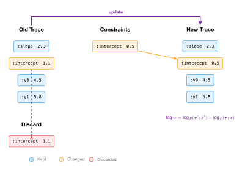

# Updating and Regenerating

So far we've used two GFI operations: `simulate` (sample everything) and `generate` (constrain some addresses, sample the rest). This chapter introduces the remaining operations — `update`, `regenerate`, `assess`, and `project` — and shows how they combine to build Metropolis-Hastings from scratch.

## Update: change some choices

`update` takes an existing trace and a choice map of new constraints. It produces a new trace where the constrained addresses take the new values, unconstrained addresses keep their old values, and the weight reflects the change in probability:

```clojure
(let [model (dyn/auto-key linear-model)
      trace (p/simulate model [xs])
      old-slope (mx/item (cm/get-choice (:choices trace) [:slope]))
      ;; Change :slope to 2.0, keep everything else
      {:keys [trace weight discard]} (p/update model trace
                                       (cm/choicemap :slope (mx/scalar 2.0)))]
  (println "new slope:" (mx/item (cm/get-choice (:choices trace) [:slope])))
  (println "weight:" (mx/item weight))
  (println "old slope in discard:" (mx/item (cm/get-choice discard [:slope]))))
```

`update` returns three things:

- **`:trace`** — the new trace with the updated choices
- **`:weight`** — \\(\log w = \log p(\boldsymbol{\tau}'; x') - \log p(\boldsymbol{\tau}; x)\\), the log ratio of new to old probability
- **`:discard`** — a choice map containing the old values that were replaced



## Weight semantics

The weight from `update` is the log ratio of the new trace's score to the old trace's score:

```clojure
(let [model (dyn/auto-key linear-model)
      trace (p/simulate model [xs])
      old-score (mx/item (:score trace))
      {:keys [trace weight]} (p/update model trace
                               (cm/choicemap :slope (mx/scalar 2.0)))
      new-score (mx/item (:score trace))
      w (mx/item weight)]
  (println "old score:" (.toFixed old-score 4))
  (println "new score:" (.toFixed new-score 4))
  (println "weight:" (.toFixed w 4))
  (println "new - old:" (.toFixed (- new-score old-score) 4)))
;; weight and (new - old) match
```

This weight is what makes `update` useful for inference: it tells you how much more (or less) probable the new trace is compared to the old one.

## The discard

The discard contains exactly the old values that were replaced — nothing more. If you update `:slope` and `:intercept`, the discard has those two addresses. Addresses you didn't change (like the observations `:y0`, `:y1`, `:y2`) are absent from the discard:

```clojure
(let [model (dyn/auto-key linear-model)
      trace (p/simulate model [xs])
      {:keys [discard]} (p/update model trace
                          (cm/choicemap :slope (mx/scalar 2.0)
                                       :intercept (mx/scalar 0.5)))]
  (println "discard has :slope?" (cm/has-value? (cm/get-submap discard :slope)))
  (println "discard has :intercept?" (cm/has-value? (cm/get-submap discard :intercept)))
  (println "discard has :y0?" (cm/has-value? (cm/get-submap discard :y0))))
;; true, true, false
```

The discard is the reverse update: if you pass it back to `update` on the new trace, you get the old trace back. This reversibility is what makes `update` correct for MCMC.

## Regenerate: resample selected addresses

While `update` lets you specify *which* values to use, `regenerate` lets you specify *which addresses to resample from the prior*. You provide a selection, and the handler resamples the selected addresses while keeping everything else:

```clojure
(let [model (dyn/auto-key linear-model)
      trace (p/simulate model [xs])
      old-intercept (mx/item (cm/get-choice (:choices trace) [:intercept]))
      ;; Resample only :slope; keep :intercept and all y's
      {:keys [trace weight]} (p/regenerate model trace (sel/select :slope))]
  (println "new slope:" (mx/item (cm/get-choice (:choices trace) [:slope])))
  (println "intercept (unchanged):" (mx/item (cm/get-choice (:choices trace) [:intercept])))
  (println "weight:" (mx/item weight)))
```

The weight from `regenerate` accounts for the proposal: the ratio of the new log-probability to the old, adjusted for the proposal mechanism. This weight is used directly in the Metropolis-Hastings acceptance criterion.

Selections control which addresses are resampled. You can target one address, several, or all:

```clojure
;; Resample both slope and intercept
(p/regenerate model trace (sel/select :slope :intercept))

;; Resample everything
(p/regenerate model trace sel/all)

;; Resample everything except :slope
(p/regenerate model trace (sel/complement-sel (sel/select :slope)))
```

## Assess: score fully-specified choices

`assess` computes the log-probability of a fully-specified choice map — every address must be provided. No sampling occurs:

```clojure
(let [model (dyn/auto-key linear-model)
      trace (p/simulate model [xs])
      ;; Assess the trace's own choices
      {:keys [weight]} (p/assess model [xs] (:choices trace))]
  (println "assess weight:" (mx/item weight))
  (println "trace score:" (mx/item (:score trace))))
;; These match — assess scores the same choices the trace recorded
```

`assess` is useful for computing the log-density of a specific configuration, for example when evaluating a proposal or scoring a model against fixed data.

## Project: score a selection

`project` computes the log-probability contribution of a subset of addresses:

```clojure
(let [model (dyn/auto-key linear-model)
      trace (p/simulate model [xs])
      ;; Score all addresses
      all-proj (mx/item (p/project model trace sel/all))
      ;; Score no addresses
      none-proj (mx/item (p/project model trace sel/none))
      ;; Score just :slope
      slope-proj (mx/item (p/project model trace (sel/select :slope)))]
  (println "project(all) =" (.toFixed all-proj 4) " = score")
  (println "project(none) =" (.toFixed none-proj 4))
  (println "project(:slope) =" (.toFixed slope-proj 4)))
```

`project(all)` equals the total score. `project(none)` is zero. `project` on a single address gives that address's log-probability contribution. This enables score decomposition — understanding how much each random choice contributes to the overall probability.

## Building Metropolis-Hastings by hand

With `regenerate` and the accept-reject criterion, we can build MH from scratch. The algorithm:

1. Start with a trace (from `generate` with observations).
2. Propose a new trace by calling `regenerate` with a selection.
3. Accept the proposal with probability \\(\min(1, \exp(\log w))\\).
4. Repeat.

The accept-reject step: draw \\(u \sim \text{Uniform}(0,1)\\). Accept if \\(\log u < \log w\\).

```clojure
(let [model (dyn/auto-key linear-model)
      obs (cm/choicemap :y0 (mx/scalar 2.5) :y1 (mx/scalar 4.5) :y2 (mx/scalar 6.5))
      ;; Initialize
      init-trace (:trace (p/generate model [xs] obs))
      ;; One MH step
      {:keys [trace weight]} (p/regenerate model init-trace (sel/select :slope))
      log-alpha (mx/item weight)
      log-u (js/Math.log (js/Math.random))
      accept? (< log-u log-alpha)
      next-trace (if accept? trace init-trace)]
  (println "log-alpha:" (.toFixed log-alpha 3))
  (println "accepted?" accept?))
```

## Running an MH chain

Wrap the single step in a loop to collect posterior samples. Use burn-in (discard early samples before the chain converges) and keep samples after:

```clojure
(let [model (dyn/auto-key linear-model)
      obs (cm/choicemap :y0 (mx/scalar 2.5) :y1 (mx/scalar 4.5) :y2 (mx/scalar 6.5))
      init-trace (:trace (p/generate model [xs] obs))
      selection (sel/select :slope :intercept)
      n-steps 200
      burn 50]
  (loop [i 0, trace init-trace, samples [], accepted 0]
    (if (>= i n-steps)
      (let [mean (/ (reduce + samples) (count samples))]
        (println "samples:" (count samples))
        (println "acceptance rate:" (.toFixed (/ accepted n-steps) 2))
        (println "posterior mean slope:" (.toFixed mean 3)))
      (let [{t :trace w :weight} (p/regenerate model trace selection)
            log-alpha (mx/item w)
            accept? (< (js/Math.log (js/Math.random)) log-alpha)
            next-trace (if accept? t trace)]
        (when (zero? (mod i 50)) (mx/sweep-dead-arrays!))
        (recur (inc i)
               next-trace
               (if (>= i burn)
                 (conj samples (mx/item (cm/get-choice (:choices next-trace) [:slope])))
                 samples)
               (if accept? (inc accepted) accepted))))))
```

With observations \\(y = [2.5, 4.5, 6.5]\\) at \\(x = [1, 2, 3]\\), the posterior mean of the slope should be near 2. The acceptance rate depends on the proposal — prior proposals (regenerating from \\(\mathcal{N}(0, 10)\\)) tend to have low acceptance rates because the prior is broad. In [Chapter 7](./ch07-inference.md) we'll see smarter proposals like random walks and HMC.

## Burn-in and thinning

Two practical considerations for MCMC:

**Burn-in:** The chain starts from a random initialization that may be far from the posterior. Early samples are unrepresentative. Discard the first `burn` samples before collecting.

**Thinning:** Consecutive samples are correlated (the chain moves in small steps). Taking every \\(k\\)-th sample reduces autocorrelation. For example, with `thin=5`, keep every 5th sample.

Both are handled naturally by the loop above. The built-in kernel framework (Chapter 7) supports burn-in and thinning as parameters.

## The five GFI operations together

Here's the complete picture of what each operation does:

| Operation | Input | Output | What it does |
|-----------|-------|--------|-------------|
| `simulate` | args | trace | Sample everything from the prior |
| `generate` | args, constraints | trace, weight | Constrain observed, sample latent |
| `update` | trace, constraints | trace, weight, discard | Change specific choices |
| `regenerate` | trace, selection | trace, weight | Resample selected addresses |
| `assess` | args, choices | weight | Score fully-specified choices |
| `project` | trace, selection | weight | Score a subset of addresses |

All six are implemented as handler transitions — pure functions with the same signature. The model body is identical in every case. Only the handler changes.

## What we've learned

- `update` changes specific choices and returns the log probability ratio as a weight, plus a discard of old values.
- `regenerate` resamples selected addresses from the prior, keeping everything else fixed.
- `assess` scores fully-specified choices without sampling.
- `project` decomposes the score by address selection.
- Metropolis-Hastings is `regenerate` + accept/reject in a loop.
- Burn-in discards early samples; thinning reduces autocorrelation.

In the next chapter, we'll see how models compose via `splice` and combinators — building hierarchical and sequential models from simple components.
