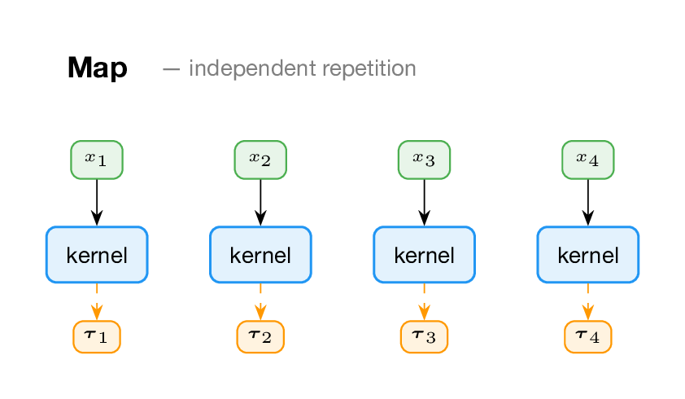
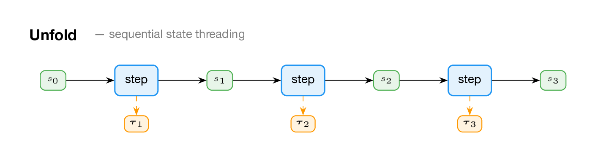
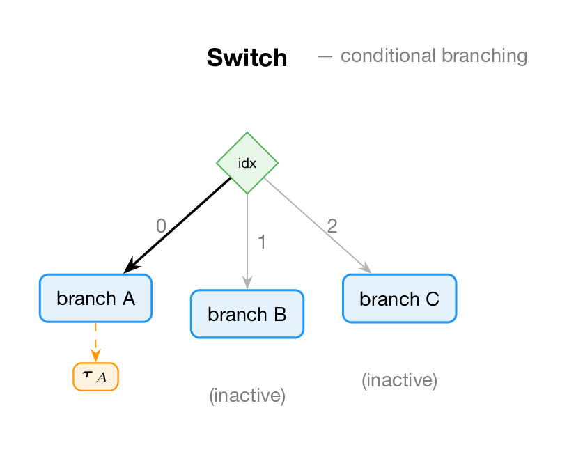

# Composition: Splice and Combinators

So far every model has been a single `gen` function. Real models have structure: a prior over parameters composed with a likelihood, a time series with repeated steps, a mixture of components. GenMLX provides two composition mechanisms:

- **Splice** — call a sub-generative function at a namespaced address within a parent model.
- **Combinators** — higher-order generative functions that build structured models from simple components.

Both produce hierarchical choice maps, and both implement the full GFI — so every inference algorithm from the previous chapters works with composed models automatically.

## Splice: calling sub-models

The `splice` effect calls a sub-generative function and nests its choices under a namespace address:

```clojure
(def prior-model
  (gen []
    (let [slope (trace :slope (dist/gaussian 0 10))
          intercept (trace :intercept (dist/gaussian 0 5))]
      {:slope slope :intercept intercept})))

(def obs-model
  (gen [params xs]
    (let [slope (:slope params)
          intercept (:intercept params)]
      (doseq [[j x] (map-indexed vector xs)]
        (trace (keyword (str "y" j))
               (dist/gaussian (mx/add (mx/multiply slope (mx/scalar x))
                                      intercept) 1))))
    nil))

(def composed-model
  (gen [xs]
    (let [params (splice :prior prior-model [])
          _ (splice :obs obs-model [params xs])]
      params)))
```

The composed model's choice map has two sub-maps: `:prior` (containing `:slope` and `:intercept`) and `:obs` (containing `:y0`, `:y1`, `:y2`). Each sub-model's choices live under its splice address, preventing name collisions.

When you condition with `generate`, you provide nested choice maps:

```clojure
(def nested-obs
  (cm/choicemap :obs (cm/choicemap :y0 (mx/scalar 2.5)
                                    :y1 (mx/scalar 4.5)
                                    :y2 (mx/scalar 6.5))))
```

## Map: independent repetition

The Map combinator applies a kernel generative function independently to each element of an input sequence:



```clojure
(def noisy-obs
  (gen [x]
    (trace :y (dist/gaussian (mx/scalar x) 1))))

(def mapped (comb/map-combinator noisy-obs))
```

Simulate it with a sequence of inputs (each input is a vector of args to the kernel):

```clojure
(let [model (dyn/auto-key mapped)
      trace (p/simulate model [[[1.0] [2.0] [3.0] [4.0]]])]
  (println "index 0 :y" (mx/item (cm/get-choice (:choices trace) [0 :y])))
  (println "index 3 :y" (mx/item (cm/get-choice (:choices trace) [3 :y]))))
```

Choices are indexed by integers: `(cm/get-submap (:choices trace) 0)` gives the first element's choice map, `(cm/get-submap (:choices trace) 3)` gives the fourth.

## Unfold: sequential state threading

The Unfold combinator threads state through a sequence of steps. Each step is a generative function that takes a timestep index and the current state, makes random choices, and returns the next state:



```clojure
(def step-kernel
  (gen [t state]
    (let [next-state (trace :z (dist/gaussian state 1))]
      (trace :obs (dist/gaussian next-state 0.5))
      next-state)))

(def unfolded (comb/unfold-combinator step-kernel))
```

Simulate with `[T init-state]` — the number of steps and the initial state:

```clojure
(let [model (dyn/auto-key unfolded)
      trace (p/simulate model [3 0.0])]
  ;; Choices indexed by timestep (0-based)
  (println "step 0 :z" (mx/item (cm/get-choice (:choices trace) [0 :z])))
  (println "step 0 :obs" (mx/item (cm/get-choice (:choices trace) [0 :obs])))
  (println "step 2 :z" (mx/item (cm/get-choice (:choices trace) [2 :z]))))
```

Unfold is the natural choice for hidden Markov models, state-space models, and any sequential generative process. Because it implements the full GFI, you can condition on observations at any timestep using `generate` with a nested choice map.

## Switch: conditional branching

The Switch combinator selects one of several branch generative functions based on a discrete index:



```clojure
(def branch-a (dyn/auto-key (gen [] (trace :x (dist/gaussian 0 1)))))
(def branch-b (dyn/auto-key (gen [] (trace :x (dist/gaussian 10 1)))))

(let [switched (comb/switch-combinator branch-a branch-b)
      model (dyn/auto-key switched)]
  ;; Index 0 selects branch-a (samples near 0)
  (let [trace (p/simulate model [0])]
    (println "branch 0 :x" (mx/item (cm/get-choice (:choices trace) [:x]))))
  ;; Index 1 selects branch-b (samples near 10)
  (let [trace (p/simulate model [1])]
    (println "branch 1 :x" (mx/item (cm/get-choice (:choices trace) [:x])))))
```

Only the selected branch executes. The trace contains only that branch's choices. Switch supports branchless GPU execution via `mx/where` when all branches have compatible trace structures — this is how GenMLX compiles conditional models (Chapter 8).

## Scan: fold with carry and inputs

The Scan combinator is like Unfold but takes per-step inputs in addition to the carried state. The kernel receives the carry and the current input, and returns a `[output carry']` pair:

```clojure
(def scan-step
  (gen [carry input]
    (let [x (trace :x (dist/gaussian (mx/add carry input) 1))]
      [x x])))  ;; [output, new-carry]

(let [scanned (comb/scan-combinator scan-step)
      model (dyn/auto-key scanned)
      inputs [(mx/scalar 0.0) (mx/scalar 1.0) (mx/scalar 2.0)]
      trace (p/simulate model [(mx/scalar 0.0) inputs])]
  (println "step 0 :x" (mx/item (cm/get-choice (:choices trace) [0 :x])))
  (println "step 2 :x" (mx/item (cm/get-choice (:choices trace) [2 :x]))))
```

## Mix: mixture models

The Mix combinator creates a stochastic mixture of component generative functions with mixing weights:

```clojure
(def component-a (gen [] (trace :x (dist/gaussian -5 1))))
(def component-b (gen [] (trace :x (dist/gaussian 5 1))))

(let [mixed (comb/mix-combinator [component-a component-b]
                                  (mx/array [(js/Math.log 0.5) (js/Math.log 0.5)]))]
  ;; Each simulate randomly selects a component
  ;; With equal weights, roughly half the samples come from each
  )
```

The second argument is a log-weight vector (unnormalized). Mix is useful for Gaussian mixture models, model averaging, and any scenario where the generative process has discrete latent structure.

## Recurse: self-referential models

The Recurse combinator creates generative functions that can call themselves, enabling tree-structured and grammar-based models:

```clojure
(let [tree (comb/recurse
             (fn [self]
               (dyn/auto-key
                (gen [depth]
                  (let [x (trace :x (dist/gaussian 0 1))]
                    (mx/eval! x)
                    (if (> depth 0)
                      (do (splice :child self [(dec depth)])
                          x)
                      x))))))]
  (let [model (dyn/auto-key tree)
        trace (p/simulate model [2])]
    (println "has :x" (cm/has-value? (cm/get-submap (:choices trace) :x)))
    (println "has :child" (not= cm/EMPTY (cm/get-submap (:choices trace) :child)))))
```

The `recurse` function takes a *maker* — a function that receives `self` (the combinator being defined) and returns a generative function that can `splice` to `self`. The depth parameter controls termination.

## Composing combinators

Because every combinator implements the full GFI, combinators compose with each other. A Map of models runs independent instances:

```clojure
(let [series-model (dyn/auto-key (gen [x] (trace :y (dist/gaussian (mx/scalar x) 1))))
      mapped (comb/map-combinator series-model)
      model (dyn/auto-key mapped)
      trace (p/simulate model [[[1.0] [2.0] [3.0]]])]
  (println "3 series:" (count (cm/addresses (:choices trace)))))
```

You can compose Map with Unfold (multiple independent time series), Switch with Mix (hierarchical mixture selection), or any other combination. The GFI guarantees that `simulate`, `generate`, `update`, and `regenerate` all work correctly through any nesting.

## Addressing conventions

Each combinator uses a specific addressing scheme:

| Combinator | Address type | Example |
|---|---|---|
| Map | Integer index | `(cm/get-submap choices 0)` |
| Unfold | Integer timestep (0-based) | `(cm/get-submap choices 2)` |
| Switch | Transparent (branch choices at top level) | `(cm/get-choice choices [:x])` |
| Scan | Integer timestep (0-based) | `(cm/get-submap choices 1)` |
| Mix | Transparent (selected component at top level) | `(cm/get-choice choices [:x])` |
| Splice | Keyword namespace | `(cm/get-submap choices :prior)` |

## What we've learned

- **Splice** calls sub-models at namespaced addresses, producing hierarchical choice maps.
- **Map** applies a kernel independently to each element of a sequence (integer-indexed).
- **Unfold** threads state through sequential steps — the natural choice for HMMs and time series.
- **Switch** selects one of several branches based on a discrete index.
- **Scan** is fold-with-carry, taking per-step inputs.
- **Mix** creates stochastic mixtures with log-weights.
- **Recurse** enables self-referential models for trees and grammars.
- All combinators implement the full GFI, so they compose with each other and with all inference algorithms.

In the next chapter, we'll use these composition tools with GenMLX's inference toolkit — composable kernels, gradient-based MCMC, SMC, and variational inference.
