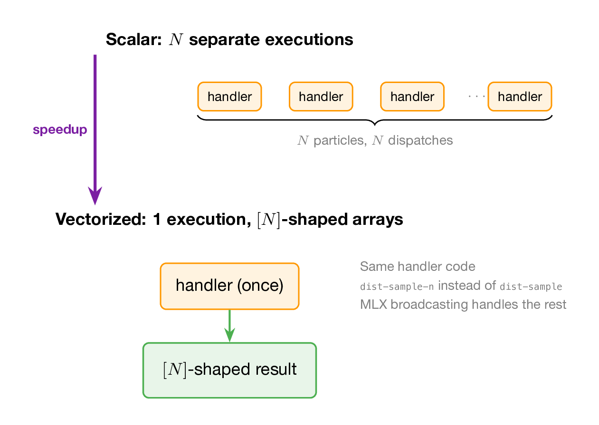
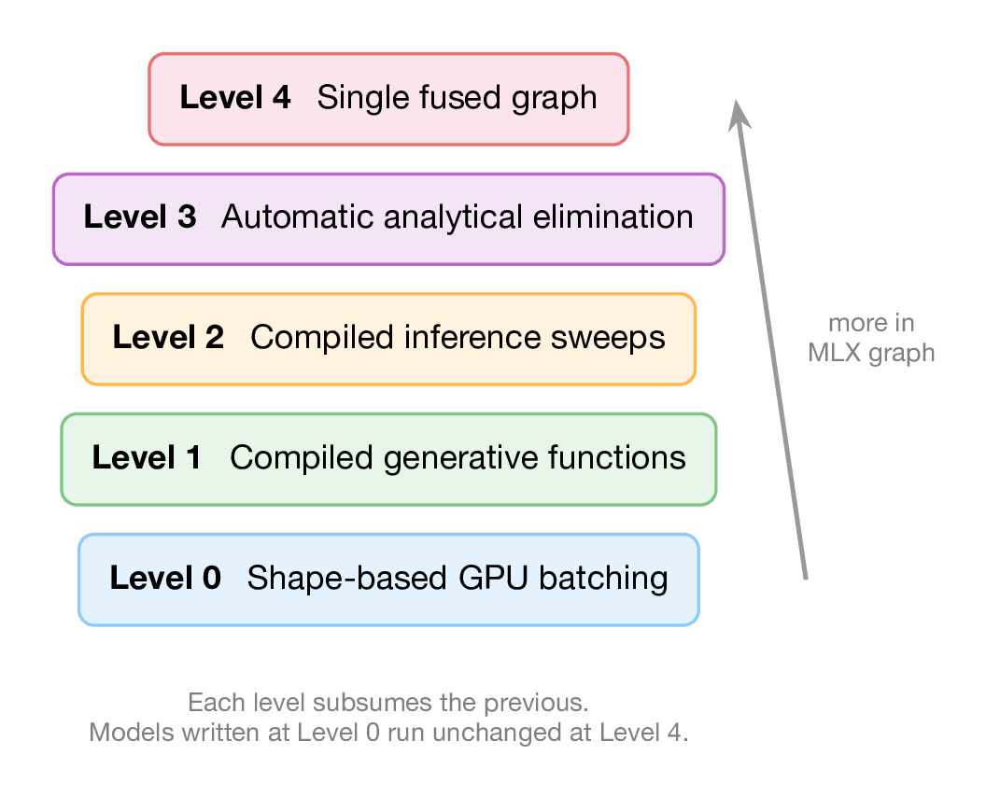

# Going Fast: Vectorization and Compilation

GenMLX runs on Apple's MLX GPU framework. This chapter shows how to exploit the GPU: vectorized inference via shape polymorphism, and the compilation ladder that progressively moves computation into fused Metal kernels.

## Shape polymorphism

The key insight: run the model **once** with \\([N]\\)-shaped arrays instead of \\(N\\) times with scalars. The handler transitions never inspect value shapes — so \\([N]\\)-shaped values flow through the same code paths as scalars. MLX broadcasting handles all arithmetic.

This works because the handler is pure. It doesn't know or care whether `:mu` holds a scalar or a 100-element vector. It calls `dist-sample-n` instead of `dist-sample`, and everything downstream — log-probability, score accumulation, weight computation — broadcasts correctly.



## vsimulate and vgenerate

`vsimulate` runs a model forward with \\(N\\) particles in parallel:

```clojure
(let [model (dyn/auto-key simple-model)
      vtrace (dyn/vsimulate model [] 100 (rng/fresh-key))]
  (println "score shape:" (mx/shape (:score vtrace)))  ;; [100]
  (let [mu-arr (cm/get-value (cm/get-submap (:choices vtrace) :mu))]
    (println ":mu shape:" (mx/shape mu-arr))))           ;; [100]
```

Everything is \\([N]\\)-shaped: the score, the choices, the weights. One execution, \\(N\\) results.

`vgenerate` adds observations — the constrained addresses get scalar values (broadcast to all particles), while latent addresses get \\([N]\\)-shaped samples:

```clojure
(let [model (dyn/auto-key simple-model)
      vtrace (dyn/vgenerate model [] obs 100 (rng/fresh-key))]
  (println "weight shape:" (mx/shape (:weight vtrace))))  ;; [100]
```

## ESS and log marginal likelihood

From a vectorized trace, compute the effective sample size and log marginal likelihood:

```clojure
(let [model (dyn/auto-key simple-model)
      vtrace (dyn/vgenerate model [] obs 200 (rng/fresh-key))
      ess (vec/vtrace-ess vtrace)
      log-ml (vec/vtrace-log-ml-estimate vtrace)]
  (println "ESS:" ess)
  (println "log-ML:" log-ml))
```

ESS tells you how many effective independent samples you have. Low ESS (relative to \\(N\\)) means the weights are concentrated on few particles — the proposal doesn't match the posterior well.

## Resampling

Resampling produces a new set of equally-weighted particles from the weighted set. GenMLX provides systematic resampling on GPU:

```clojure
(let [model (dyn/auto-key simple-model)
      vtrace (dyn/vgenerate model [] obs 50 (rng/fresh-key))
      resampled (vec/resample-vtrace vtrace (rng/fresh-key))]
  (println "resampled score shape:" (mx/shape (:score resampled))))
```

Resampling is implemented as pure MLX operations: cumulative weight sums via `mx/cumsum`, uniform offsets via `mx/arange`, and index lookup via `mx/searchsorted`. No host-side branching.

## The schema

When the `gen` macro creates a model, it also extracts a **schema** from the source code — a structural description of all trace sites, their distribution types, dependencies, and classifications:

```clojure
(let [schema (:schema simple-model)]
  (println "static?" (:static? schema))
  (println "trace sites:" (mapv :addr (:trace-sites schema))))
```

The schema enables everything that follows: compiled execution, partial compilation, and auto-analytical elimination.

## Compiled generative functions

For **static models** — where all trace addresses are known at construction time — GenMLX compiles the model body into a single function that performs all sampling and scoring as flat tensor operations:

```clojure
(def static-model
  (gen []
    (let [a (trace :a (dist/gaussian 0 1))
          b (trace :b (dist/gaussian 0 1))]
      (mx/add a b))))

(println "static?" (:static? (:schema static-model)))  ;; true
```

When a static model is simulated or generated, the compiled path fires automatically — one Metal dispatch instead of per-site handler calls. For partially static models (some dynamic addresses), the static prefix is compiled and the dynamic suffix falls through to the handler.



## The compilation ladder

GenMLX implements five compilation levels, each moving more computation into the MLX graph:

| Level | What's compiled | Speedup |
|---|---|---|
| 0 | Shape-based GPU batching | baseline |
| 1 | Model body as single Metal dispatch | 3-5x |
| 2 | Full SMC/MCMC sweep in one graph | 15-77x |
| 3 | Conjugate structure eliminated analytically | 33x variance reduction |
| 4 | Model + inference + gradient + optimizer fused | 9x |

Each level subsumes the previous. Models written at Level 0 run unchanged at Level 4. The handler path remains ground truth at every stage.

## Auto-analytical elimination

Level 3 detects conjugate prior-likelihood pairs in the model schema and eliminates sampling algebraically. For example, in a model with a Gaussian prior on the mean and Gaussian observations, the system computes the exact marginal likelihood instead of sampling the mean:

- Normal-Normal (unknown mean)
- Beta-Bernoulli (unknown probability)
- Gamma-Poisson (unknown rate)
- Gamma-Exponential (unknown rate)
- Dirichlet-Categorical (unknown mixing weights)

This happens automatically — no annotations, no middleware composition. The `gen` macro detects the structure and wires the analytical handlers at construction time.

## The fit API

For users who want results without choosing algorithms, `fit` auto-selects the inference method from the model's schema metadata:

```clojure
;; (fit model args data) — auto-selects method, runs inference
```

The decision tree examines conjugate structure, temporal patterns, dimensionality, and stochastic control flow to choose between exact (conjugate), Kalman filter (linear-Gaussian temporal), SMC (nonlinear temporal), HMC (static, few dimensions), VI (high-dimensional), or handler-based IS (fallback).

## Limitations

- **No splice in vectorized mode**: `vsimulate`/`vgenerate` don't support `splice` for non-`DynamicGF` sub-functions. Use the `vmap-gf` combinator instead.
- **Scalar observations only**: constrained addresses in `vgenerate` must have scalar values (they broadcast to all particles).
- **Dynamic models**: models with stochastic control flow or data-dependent addresses get less compilation benefit.

## What we've learned

- **Shape polymorphism**: the same handler code works at any shape because it never inspects values.
- `vsimulate` and `vgenerate` run \\(N\\) particles in a single execution.
- The **schema** describes model structure at construction time.
- **Compiled paths** replace per-site handler calls with fused Metal dispatches.
- **Auto-analytical elimination** detects conjugate structure and eliminates sampling.
- The **compilation ladder** (Levels 0-4) progressively fuses more computation into the GPU graph.

In the next chapter, we'll cover gradients, parameter learning, and neural network integration.
